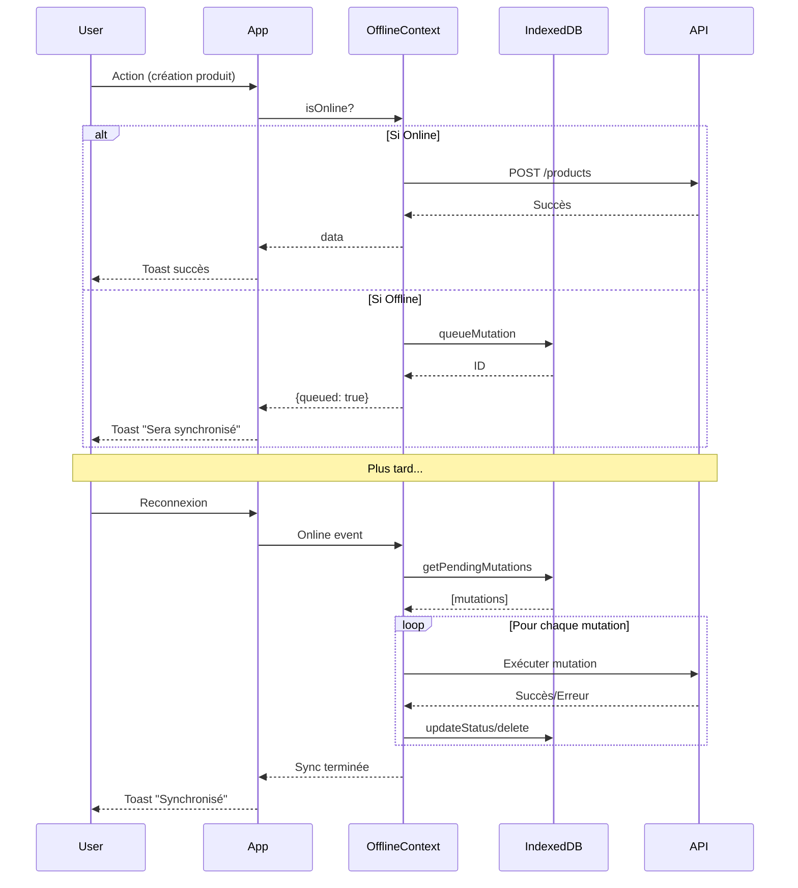

# Résumé de l'implémentation du mode offline

## Fichiers créés

### 1. Hooks

- **`/frontend/src/hooks/useOffline.js`**
  - Hook pour détecter le statut online/offline
  - Utilise `navigator.onLine` et les événements `online`/`offline`
  - Expose `isOnline`, `wasOffline`, `lastOnlineAt`, `offlineSince`

- **`/frontend/src/hooks/useOfflineMutation.js`**
  - Hook générique pour les mutations avec support offline
  - Hooks spécialisés : `useOfflineCreate`, `useOfflineUpdate`, `useOfflinePatch`, `useOfflineDelete`
  - Ajoute automatiquement les mutations à la queue quand offline
  - Retourne une réponse optimiste avec `queued: true`

### 2. Services

- **`/frontend/src/services/offlineStorage.js`**
  - Gestion complète d'IndexedDB
  - 3 stores : `cache`, `mutations`, `metadata`
  - Fonctions de cache : `saveToCache`, `loadFromCache`, `isCacheValid`, `clearCacheEntry`, `clearAllCache`
  - Gestion de la queue : `queueMutation`, `getPendingMutations`, `updateMutationStatus`, `deleteMutation`, `clearCompletedMutations`
  - Métadonnées : `saveMetadata`, `loadMetadata`
  - Statistiques : `getStorageStats`
  - Constantes : `CACHE_KEYS` pour les clés de cache prédéfinies

### 3. Contextes

- **`/frontend/src/contexts/OfflineContext.jsx`**
  - Provider pour l'état offline global
  - Gère la détection online/offline via `useOffline`
  - Synchronise automatiquement les mutations à la reconnexion
  - Met en cache les données essentielles toutes les 2 minutes
  - Charge les données depuis le cache quand offline
  - Expose : `isOnline`, `wasOffline`, `pendingMutations`, `isSyncing`, `syncError`, `storageStats`, `addPendingMutation`, `syncPendingMutations`, `refreshStats`

### 4. Composants UI

- **`/frontend/src/components/feedback/OfflineBanner.jsx`**
  - Bannière fixe en haut pour afficher le statut
  - Animation Framer Motion (slide-down)
  - Mode offline : Bannière orange avec durée et nombre de mutations
  - Mode reconnexion : Bannière verte avec état de synchronisation
  - Erreur de sync : Bannière rouge avec message
  - Version compacte pour mobile : `OfflineBannerCompact`

### 5. Documentation

- **`/frontend/OFFLINE_MODE.md`**
  - Documentation complète du mode offline
  - Guide d'utilisation avec exemples
  - Référence de l'API
  - Bonnes pratiques
  - Guide de débogage

- **`/frontend/IMPLEMENTATION_SUMMARY.md`** (ce fichier)
  - Résumé de l'implémentation
  - Liste des fichiers créés
  - Instructions de test

### 6. Exemples et tests

- **`/frontend/src/examples/OfflineModeExample.jsx`**
  - Composant de démonstration
  - Exemples de création, mise à jour, suppression
  - Affichage des mutations en attente
  - Instructions de test

- **`/frontend/src/services/__tests__/offlineStorage.test.js`**
  - Tests unitaires pour offlineStorage
  - Couverture : cache, mutations queue, métadonnées, statistiques

### 7. Types (référence)

- **`/frontend/src/types/offline.d.ts`**
  - Définitions TypeScript pour référence
  - Documentation des interfaces
  - Utile pour migration TypeScript future

## Fichiers modifiés

### 1. Configuration React Query

- **`/frontend/src/main.jsx`**
  - Import de `OfflineProvider`
  - Configuration QueryClient optimisée pour offline :
    - `networkMode: 'offlineFirst'` pour queries et mutations
    - Retry intelligent (pas de retry si offline)
    - `refetchOnReconnect: true`
  - Ajout du `OfflineProvider` dans la hiérarchie des providers

### 2. Layout principal

- **`/frontend/src/app/AppShell.jsx`**
  - Import du composant `OfflineBanner`
  - Ajout de `<OfflineBanner />` en haut de la page

### 3. Exports des hooks

- **`/frontend/src/hooks/index.js`**
  - Export de `useOffline`
  - Export de `useOfflineMutation` et hooks spécialisés

## Hiérarchie des providers

```jsx
<QueryClientProvider>
  <AuthProvider>
    <TenantProvider>
      <OfflineProvider>  ← Nouveau
        <ToastProvider>
          <BrowserRouter>
            <App />
          </BrowserRouter>
        </ToastProvider>
      </OfflineProvider>
    </TenantProvider>
  </AuthProvider>
</QueryClientProvider>
```

## Structure IndexedDB

```
inventaire-offline (DB)
├── cache (Store)
│   ├── products
│   ├── vendors
│   ├── categories
│   ├── finance_transactions
│   ├── finance_accounts
│   ├── restaurant_plats
│   ├── restaurant_ingredients
│   └── cockpit_overview
│
├── mutations (Store)
│   └── [mutations avec ID auto-incrémenté]
│
└── metadata (Store)
    └── [métadonnées système]
```

## Flux de synchronisation



## Comment tester

### Test manuel

1. Ouvrir l'application dans Chrome
2. Ouvrir les DevTools (F12)
3. Aller dans l'onglet **Network**
4. Sélectionner **Offline** dans le menu **Throttling**
5. Effectuer des actions (créer un produit, modifier une transaction, etc.)
6. Vérifier que la bannière orange s'affiche
7. Vérifier dans l'onglet **Application → IndexedDB → inventaire-offline → mutations**
8. Remettre en **Online**
9. Vérifier que la synchronisation se lance automatiquement
10. Vérifier que les données sont envoyées à l'API

### Test avec le composant d'exemple

1. Créer une route pour le composant d'exemple :

```jsx
// Dans routes.jsx
import OfflineModeExample from '@/examples/OfflineModeExample.jsx';

{
  path: '/example/offline',
  label: 'Offline Example',
  element: <OfflineModeExample />,
}
```

2. Naviguer vers `/example/offline`
3. Suivre les instructions affichées

### Tests unitaires

```bash
cd frontend
npm test -- offlineStorage.test.js
```

## Utilisation dans le code existant

### Migration d'une mutation existante

**Avant :**
```jsx
const createMutation = useMutation({
  mutationFn: (data) => createProduct(data),
  onSuccess: () => {
    queryClient.invalidateQueries(['products']);
  },
});
```

**Après :**
```jsx
import { useOfflineCreate } from '@/hooks';

const createMutation = useOfflineCreate({
  endpoint: '/catalog/products',
  mutationFn: (data) => createProduct(data),
  onSuccess: (data) => {
    if (!data.queued) {
      queryClient.invalidateQueries(['products']);
    }
  },
});
```

### Afficher le statut offline

```jsx
import { useOfflineContext } from '@/contexts/OfflineContext';

function MyComponent() {
  const { isOnline, pendingMutations } = useOfflineContext();

  return (
    <div>
      {!isOnline && (
        <div className="bg-amber-100 p-2">
          Mode hors-ligne - {pendingMutations.length} modifications en attente
        </div>
      )}
      {/* Reste du composant */}
    </div>
  );
}
```

## Points d'attention

### 1. Gestion des erreurs

Les mutations échouées sont marquées comme `failed` mais restent dans la queue. Il faut décider :
- Les réessayer automatiquement ?
- Les supprimer automatiquement après X tentatives ?
- Laisser l'utilisateur décider ?

**Actuellement** : Elles restent marquées comme `failed` et ne sont pas réessayées.

### 2. Résolution de conflits

Si les données ont changé sur le serveur entre le moment où l'utilisateur était offline et la synchronisation, **la dernière mutation écrase les données**.

Il n'y a pas de résolution de conflits sophistiquée (merge, conflict detection, etc.).

### 3. Validation côté serveur

Les mutations offline ne peuvent pas être validées avant la synchronisation. Si le serveur rejette une mutation, elle sera marquée comme `failed` avec le message d'erreur.

### 4. Optimistic Updates

Les mutations offline retournent `{queued: true}` mais ne modifient pas le cache React Query de manière optimiste. Il faudrait implémenter des optimistic updates manuellement si nécessaire.

### 5. Nettoyage de la queue

Les mutations `completed` et `failed` restent dans IndexedDB. Il faut les nettoyer manuellement avec `clearCompletedMutations()` ou implémenter un nettoyage automatique.

## Prochaines étapes possibles

1. **Optimistic Updates** : Mettre à jour le cache React Query de manière optimiste
2. **Résolution de conflits** : Détecter et gérer les conflits de données
3. **Retry automatique** : Réessayer automatiquement les mutations échouées
4. **Nettoyage automatique** : Supprimer automatiquement les mutations terminées
5. **Persistance du cache** : Persister le cache React Query dans IndexedDB (pas juste sessionStorage)
6. **Service Worker** : Implémenter un Service Worker pour intercepter les requêtes réseau
7. **Background Sync** : Utiliser l'API Background Sync pour synchroniser en arrière-plan
8. **Push Notifications** : Notifier l'utilisateur quand la synchronisation est terminée
9. **Stratégies de cache** : Cache-first, Network-first, Stale-While-Revalidate
10. **Compression** : Compresser les données en cache pour économiser de l'espace

## Ressources

- [MDN - IndexedDB API](https://developer.mozilla.org/en-US/docs/Web/API/IndexedDB_API)
- [TanStack Query - Network Mode](https://tanstack.com/query/latest/docs/react/guides/network-mode)
- [Navigator.onLine](https://developer.mozilla.org/en-US/docs/Web/API/Navigator/onLine)
- [Background Sync API](https://developer.mozilla.org/en-US/docs/Web/API/Background_Synchronization_API)
