# Livrables de conception - Dossier client

## Table des matieres
1. Conception (conception et architecture)
2. Specifications fonctionnelles generales (SFG)
3. Specifications fonctionnelles detaillees (SFD)
4. Diagrammes UML
5. Wireframes / maquettes fonctionnelles
6. Dossier d’architecture technique (DAT)
7. Specifications techniques (ST)
8. Schemas d’architecture
9. Modele de donnees (MCD/MLD)


# Conception (conception et architecture)

# Conception (conception et architecture)

## 1. Vision produit
Plateforme unifiee pour piloter les activites Epicerie, Restaurant et Tresorerie.
Objectif : fiabiliser les donnees, industrialiser les flux (factures, stock, tresorerie)
et fournir une vision marge/ROI exploitable au quotidien.

## 2. Perimetre fonctionnel (modules)
- Opérations : catalogue, stock, factures, prix, approvisionnement.
- Restaurant : ingredients, plats, couts, menus, transferts.
- Finance : releves, categorisation, rapprochement, audit.
- Intelligence : previsions, optimisation stock, anomalies, marges.
- Tableau de bord : indicateurs consolides et alertes.
- Admin : configuration, securite, roles.

## 3. Principes de conception
- Multi-tenant natif (isolation des donnees par tenant).
- API-first : contrats stables pour SPA et integrations.
- Traçabilite : historisation des prix, mouvements et rapprochements.
- Observabilite : journaux structures, metriques, alertes.
- Robustesse : idempotence pour les operations sensibles.
- Evolutivite : modules independants et versionnables.

## 4. Architecture logique
Composants principaux :
- SPA React (Vite + Tailwind) pour les vues metier.
- API FastAPI pour la logique et l’orchestration.
- PostgreSQL multi-tenant (schema principal + tables analytiques).
- Traitements asynchrones (imports, recalculs, notation).
- Cache (Redis) optionnel pour acceleration.

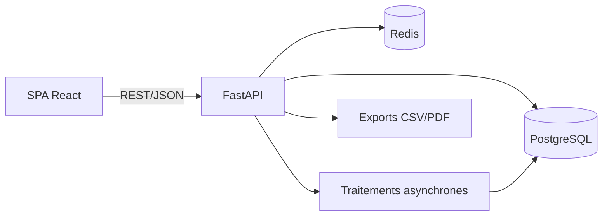

## 4.1 Arbre fonctionnel (ASCII)
```
Plateforme
|-- Opérations
|   |-- Catalogue
|   |-- Stock & inventaires
|   |-- Factures fournisseurs
|   |-- Prix & approvisionnement
|-- Restaurant
|   |-- Ingredients
|   |-- Plats & menus
|   |-- Stock restaurant
|-- Finance
|   |-- Releves & categorisation
|   |-- Rapprochement
|   |-- Regles
|-- Intelligence
|   |-- Previsions
|   |-- Optimisation stock
|   |-- Anomalies
|   |-- Notation fournisseurs
|   |-- Marges
|-- Tableau de bord
|   |-- Indicateurs
|   |-- Alertes
`-- Admin
    |-- Tenants
    |-- Roles & droits
    `-- Audit
```

## 4.2 Carte des modules (graphe)
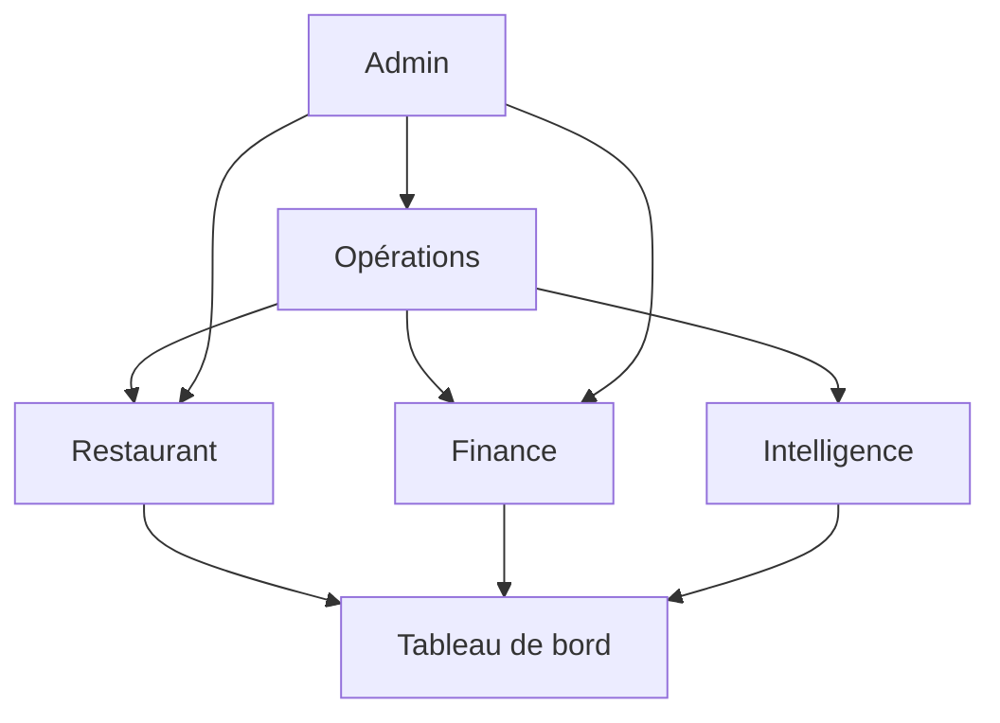

## 5. Flux metiers majeurs
- Factures fournisseurs : import -> extraction -> rapprochement -> validation -> mise a jour stock/prix.
- Stock : mouvements -> mise a jour stock_actuel -> alertes seuils.
- Restaurant : ingredients -> plats -> calcul couts -> menus.
- Tresorerie : import -> categorisation -> rapprochement -> export comptable.
- Intelligence : calculs (EOQ, ABC/XYZ, marges, previsions) -> synthese tableau de bord.

## 5.1 Graphe des flux de donnees (tracabilite)
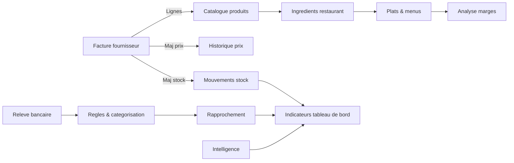

## 5.2 Arbre des flux critiques (ASCII)
```
Flux critiques
|-- Facture -> Stock -> Alertes
|-- Facture -> Prix -> Marges
|-- Releve -> Categorisation -> Rapprochement -> Exports
|-- Ingredients -> Plats -> Prix vente
`-- Ventes -> Previsions -> Approvisionnement
```

## 5.3 Tracabilite par module
### 5.3.1 Opérations
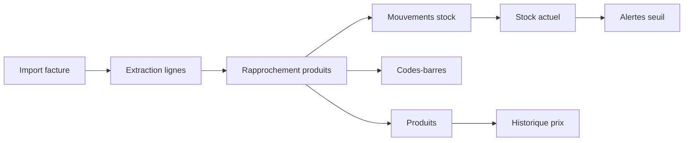

### 5.3.2 Restaurant
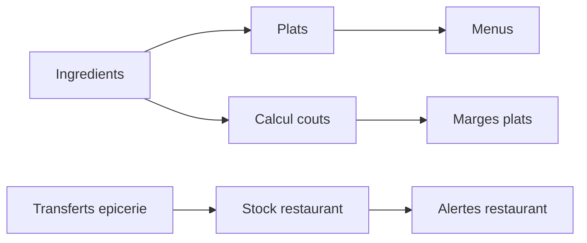

### 5.3.3 Finance
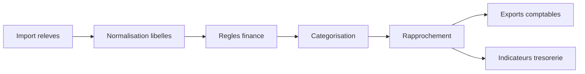

### 5.3.4 Intelligence
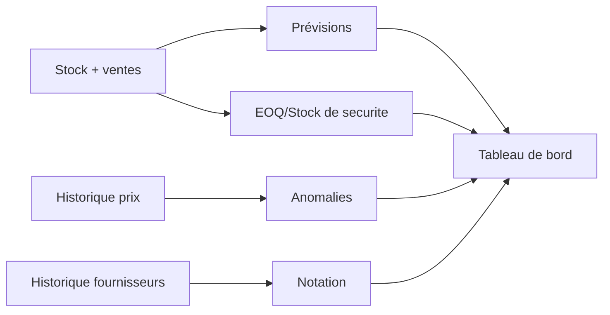

## 6. Securite et gouvernance
- Authentification OAuth2/JWT.
- RBAC par module et par action.
- Journal d’audit des operations sensibles.
- Isolation des donnees par tenant.

## 7. Exigences non fonctionnelles
- Disponibilite : 99.5% cible.
- Performance : P90 < 300ms pour les endpoints critiques.
- Resilience : reprise d’imports et rejouabilite.
- Traçabilite : historique et audit complet.

## 8. Risques et mitigations
- Qualite des donnees (doublons, libelles incoherents) : workflow data-quality.
- Imports heterogenes : mapping, regles, rapport d’erreurs.
- Charge analytique : cache + tables de synthese.

## 9. Livrables associes
- SFG, SFD.
- UML (cas d’usage, sequence, activites).
- Wireframes fonctionnels.
- DAT, ST, schemas d’architecture, MCD/MLD.


# Specifications fonctionnelles generales (SFG)

# Specifications fonctionnelles generales (SFG)

## 1. Contexte
Plateforme web pour la gestion integree Epicerie/Restaurant/Tresorerie avec un module
Intelligence (previsions, optimisation, alertes) et un tableau de bord consolide.

## 2. Objectifs business
- Reduire les ecarts stock/inventaire.
- Fiabiliser les prix d’achat et les marges.
- Accelerer les rapprochements comptables.
- Centraliser indicateurs et alertes.

## 3. Acteurs et droits
- Gerant : tous droits, parametres.
- Responsable achats : produits, fournisseurs, factures.
- Responsable stock : inventaires, mouvements, alertes.
- Responsable restaurant : ingredients, plats, couts.
- Comptable/Finance : tresorerie, regles, rapprochement.
- Analyste : lecture des tableaux de bord, intelligence.

## 4. Perimetre fonctionnel
### 4.1 Opérations
- Catalogue produits, codes-barres, prix.
- Mouvements stock, alertes, inventaires.
- Factures fournisseurs et import.
- Approvisionnement et recommandations.

### 4.2 Restaurant
- Ingredients, plats, menus.
- Calculs couts/marges.
- Transferts et mouvements stock restaurant.

### 4.3 Finance
- Import releves bancaires.
- Regles de categorisation.
- Rapprochement transactions/factures.
- Exports comptables.

### 4.4 Intelligence
- Previsions ventes/cashflow.
- Optimisation stock (EOQ, stock de securite, points de reapprovisionnement).
- Detection anomalies.
- Notation fournisseurs.
- Analyses marges.

### 4.5 Gouvernance
- Multi-tenant et roles.
- Journal d’audit.
- Sauvegardes et reprise.

### 4.6 Carte fonctionnelle (ASCII)
```
Utilisateurs
|-- Gerant
|-- Achats
|-- Stock
|-- Restaurant
|-- Finance
`-- Analyste

Fonctions
|-- Opérations
|-- Restaurant
|-- Finance
|-- Intelligence
|-- Tableau de bord
`-- Admin
```

### 4.7 Matrice acteurs x modules (ASCII)
```
Acteurs \\ Modules | Opérations | Restaurant | Finance | Intelligence | Tableau de bord | Admin
------------------+------------+------------+---------+--------------+-----------------+------
Gerant            |    X       |     X      |   X     |      X       |   X     |  X
Resp. achats      |    X       |            |         |              |         |
Resp. stock       |    X       |     X      |         |      X       |   X     |
Resp. restaurant  |            |     X      |         |              |   X     |
Comptable         |            |            |   X     |              |   X     |
Analyste          |            |            |   X     |      X       |   X     |
```

### 4.8 Arbres detailles par sous-domaine (ASCII)
```
Opérations
|-- Catalogue
|   |-- Produits
|   |-- Codes-barres
|   `-- Historique prix
|-- Stock
|   |-- Mouvements
|   |-- Inventaires
|   `-- Alertes
`-- Factures
    |-- Import
    |-- Rapprochement
    `-- Validation
```

```
Finance
|-- Releves
|   |-- Import
|   `-- Normalisation
|-- Regles
|   |-- Creation
|   |-- Priorites
|   `-- Exceptions
|-- Categorisation
|   |-- Auto
|   `-- Manuelle
`-- Rapprochement
    |-- Rapprochement auto
    `-- Validation
```

```
Restaurant
|-- Ingredients
|-- Plats
|   |-- Composition
|   `-- Cout/marge
|-- Menus
`-- Stock restaurant
```

## 5. Exigences non fonctionnelles
- Disponibilite : 99.5% cible.
- Performance : P90 < 300ms endpoints critiques.
- Securite : RBAC, isolation tenant, TLS.
- Observabilite : journaux structures + metriques.

## 6. Hypotheses
- Les imports fournisseurs sont heterogenes mais exploitables.
- Les codes-barres sont uniques par tenant.
- L’authentification est interne (pas SSO).

## 7. Criteres d’acceptation globaux
- Un produit peut etre cree, utilise en stock et en recette.
- Une facture importee met a jour prix et stock apres validation.
- Les previsions sont consultables par periode.
- Un releve bancaire est categorise et exportable.
- Les alertes stock et anomalies sont visibles dans le tableau de bord.


# Specifications fonctionnelles detaillees (SFD)

# Specifications fonctionnelles detaillees (SFD)

## 1. Catalogue produits
### 1.1 Creation produit
Champs obligatoires : nom, unite, type (stockable/non-stockable).
Optionnels : categorie, codes-barres, TVA, seuil_alerte.
Regles :
- Un code-barres est unique par tenant.
- Un produit supprime est archive (pas de suppression physique).

### 1.2 Historique des prix
- Chaque modification de prix d’achat cree une entree d’historique.
- Le prix actif = derniere entree validee.

### 1.3 Qualite catalogue
- Detection doublons (nom proche, code-barres similaire).
- Ecran de fusion avec conservation de l’historique.

## 2. Stock et inventaires
### 2.1 Mouvements
Types : ENTREE, SORTIE, TRANSFERT, INVENTAIRE.
Chaque mouvement enregistre date, utilisateur, source et quantite.

### 2.2 Inventaire
- Session par zone.
- Saisie quantites constatees.
- Calcul ecarts.
- Validation -> ajustement stock_actuel.

### 2.3 Alertes
- Seuil minimum par produit.
- Liste priorisee des ruptures et quasi-ruptures.

## 3. Factures fournisseurs
### 3.1 Import
Formats : PDF, CSV.
Extraction : libelle, quantite, prix unitaire, total.

### 3.2 Rapprochement
Priorites : code-barres, ref fournisseur (SKU), similarite libelle.
Lignes non resolues : correction manuelle obligatoire.

### 3.3 Validation
- Creation/maj produit si accepte.
- Maj prix d’achat + stock si facture livree.
- Journal d’audit associe.

## 4. Restaurant
### 4.1 Ingredients
- Creer/consulter/modifier/supprimer ingredients.
- Liaison optionnelle a un produit epicerie.
- Historique des prix ingredient.

### 4.2 Plats et menus
- Plat = liste d’ingredients + quantites.
- Calcul cout matiere par plat.
- Menus = aggregation de plats.
- Simulation de prix de vente.

### 4.3 Stock restaurant
- Mouvements dedies + transferts depuis epicerie.
- Tableau de bord stock restaurant.

## 5. Finance
### 5.1 Import releves
Formats CSV/OFX.
Normalisation des libelles.

### 5.2 Categorisation
Regles automatiques (mots-cles, IBAN, montant).
Transactions non categorisees en attente.

### 5.3 Rapprochement
- Rapprochement automatique transactions/factures.
- Creation d’alias fournisseurs.
- Rapprochement manuel si necessaire.

## 6. Intelligence
### 6.1 Previsions
- Ventes (periode, categorie, produit).
- Tresorerie (entre/sorties).

### 6.2 Optimisation stock
- EOQ (quantite economique de commande).
- Stock de securite.
- Points de reapprovisionnement et suggestions.
- Classification ABC/XYZ.

### 6.3 Anomalies
- Detection d’anomalies prix/stock.
- Rapport et suivi des resolutions.

### 6.4 Notation fournisseurs
- Score global et par dimension.
- Historique et alertes.

### 6.5 Marges
- Instantanes et evolution.
- Analyse par categorie et produit.

## 7. Gouvernance et securite
- RBAC par module.
- Journal d’audit (actions, modifications, rapprochements).
- Sauvegardes planifiees.

## 8. Cas limites
- Facture annulee : creation d’une operation inverse.
- Transaction bancaire ancienne : rapprochement manuel.
- Multi-tenant : aucune fuite inter-tenant.

## 9. Parcours end-to-end (ASCII)
```
1) Catalogue
   -> Creation produit -> Code-barres -> Prix
2) Facture
   -> Import -> Rapprochement -> Validation -> Stock + Prix
3) Restaurant
   -> Ingredients -> Plats -> Menus -> Prix vente
4) Finance
   -> Releve -> Regles -> Rapprochement -> Export
5) Intelligence
   -> Previsions -> Suggestions -> Actions
```

## 10. Flux de validation facture (graphe)
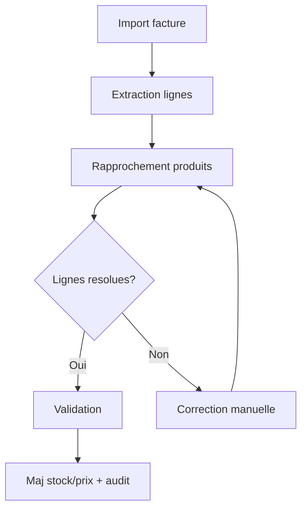

## 11. Arbres par processus (ASCII)
```
Processus Facture fournisseur
|-- Import
|   |-- Televersement PDF/CSV
|   `-- Controle format
|-- Extraction
|   |-- Parsing lignes
|   `-- Normalisation libelles
|-- Rapprochement
|   |-- Code-barres
|   |-- Ref fournisseur (SKU)
|   `-- Similarite libelle
|-- Validation
|   |-- Correction manuelle
|   `-- Confirmation
`-- Impact
    |-- Maj prix
    |-- Maj stock
    `-- Audit
```

```
Processus Inventaire
|-- Preparation
|   |-- Zone
|   `-- Responsable
|-- Saisie
|   |-- Scan produit
|   `-- Quantite constatee
|-- Ecart
|   |-- Calcul automatique
|   `-- Justification
`-- Validation
    |-- Ajustements stock
    `-- Cloture session
```

```
Processus Rapprochement bancaire
|-- Import releve
|   |-- CSV/OFX
|   `-- Normalisation
|-- Categorisation
|   |-- Regles auto
|   `-- Manuelle
|-- Rapprochement
|   |-- Factures
|   `-- Operations internes
`-- Validation
    |-- Statut rapproche
    `-- Export comptable
```

```
Processus Synchronisation prix restaurant
|-- Preparation
|   |-- Liens epicerie
|   `-- Ingredients eligibles
|-- Synchronisation
|   |-- Recuperation prix
|   `-- Mise a jour ingredient
`-- Suivi
    |-- Historique prix
    `-- Rapport synchro
```

```
Processus Previsions et approvisionnement
|-- Collecte
|   |-- Ventes historiques
|   `-- Stock courant
|-- Calcul
|   |-- Previsions
|   `-- Stock de securite
|-- Suggestion
|   |-- Points de reapprovisionnement
|   `-- Plan d’appro
`-- Execution
    |-- Creation commande
    `-- Suivi livraison
```


# Diagrammes UML

# Diagrammes UML

## 1. Cas d’usage (vue d’ensemble)
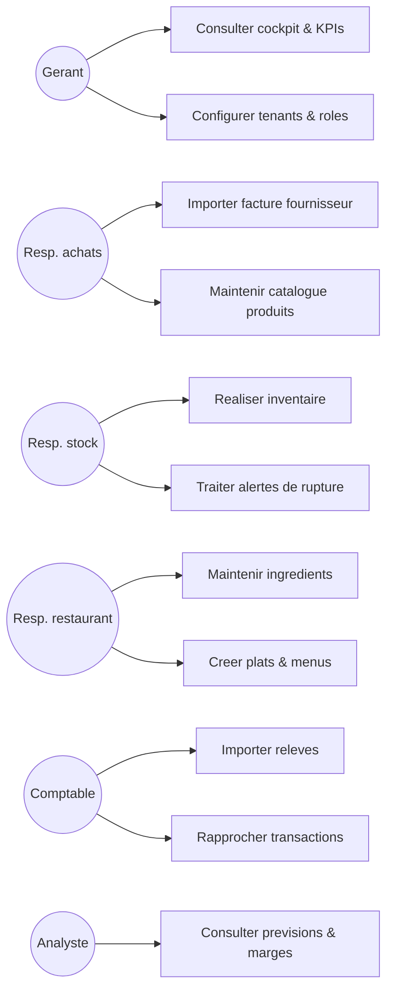

## 1.1 Diagramme de composants (haut niveau)
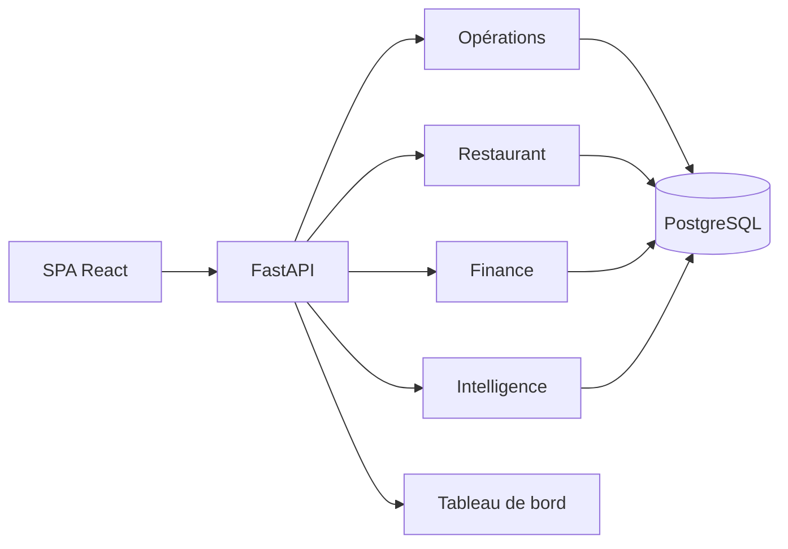

## 2. Sequence : Import facture fournisseur
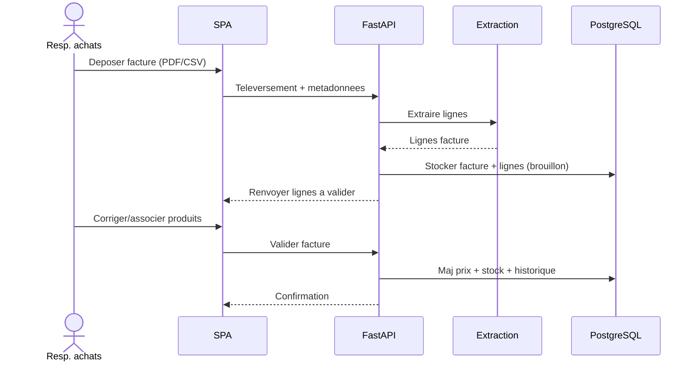

## 3. Sequence : Rapprochement bancaire
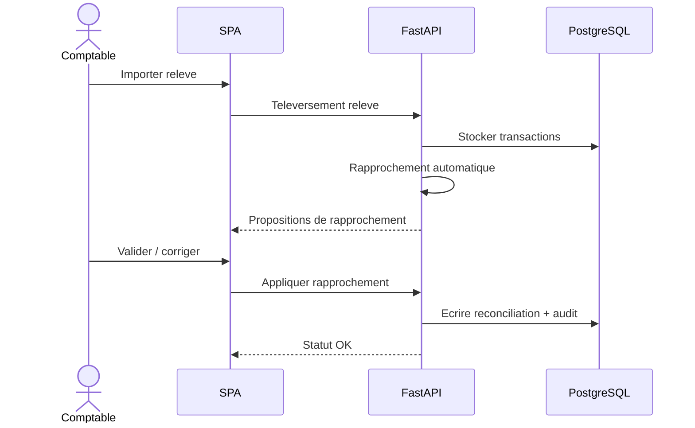

## 4. Sequence : Optimisation stock (EOQ / reapprovisionnement)
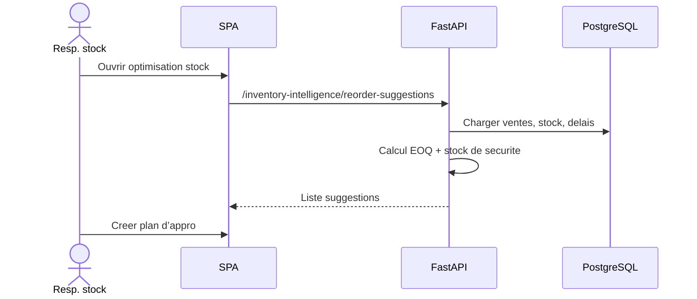

## 5. Sequence : Synchronisation prix restaurant
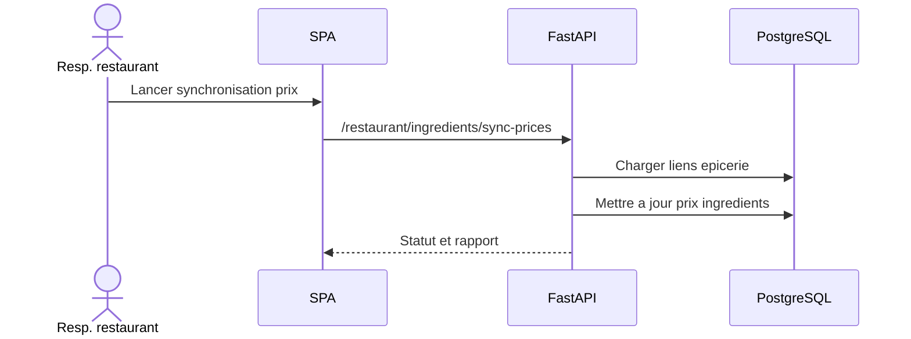

## 6. Activite : Inventaire
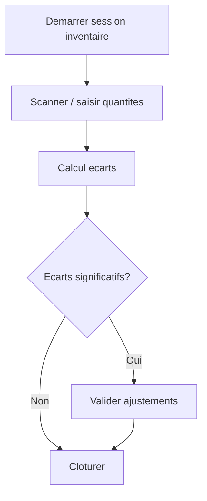

## 7. Activite : Categorisation bancaire
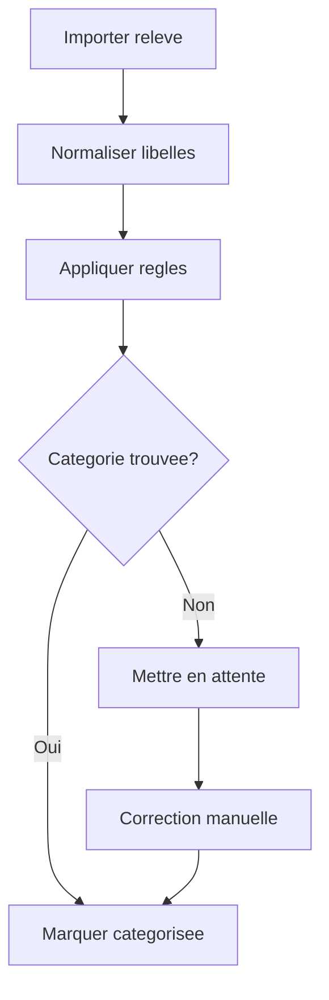

## 8. Etat : Facture fournisseur
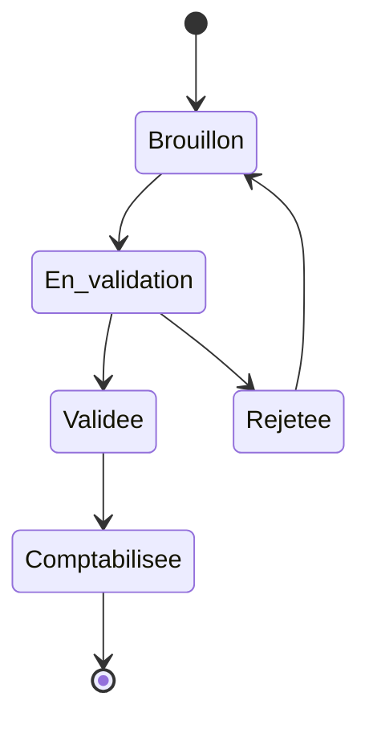

## 9. Sequence : Ajustement stock (inventaire)
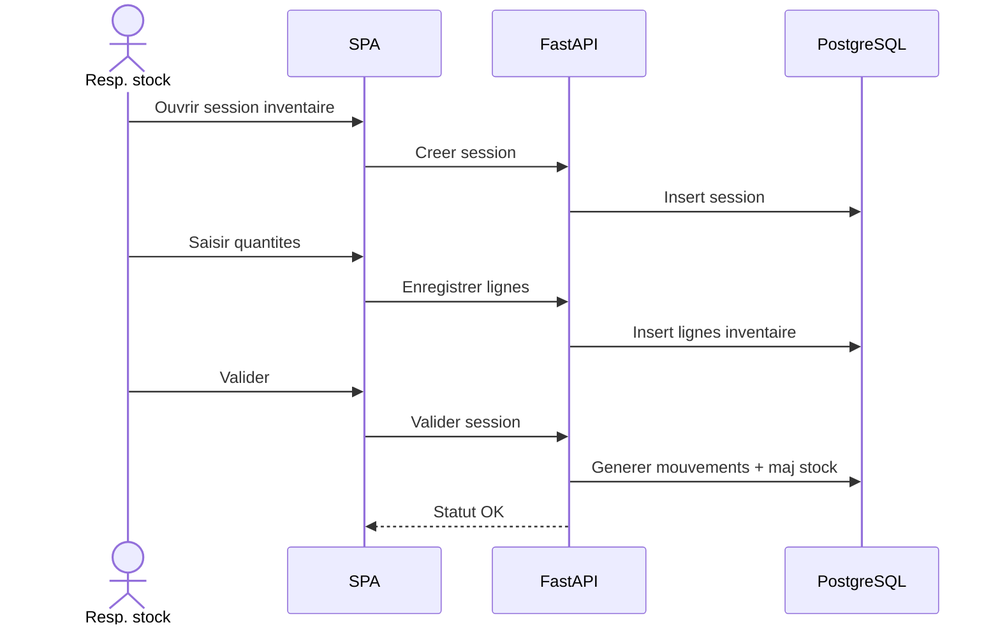

## 10. Sequence : Application regles finance
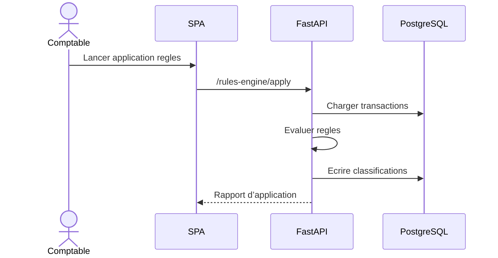

## 11. Diagramme de classes (domaines cles)
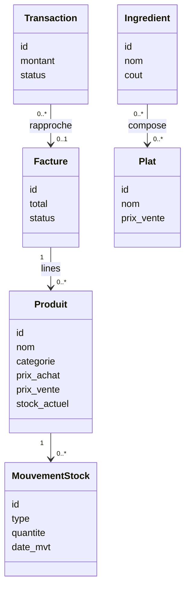

## 12. Sequence : Calcul marges (snapshots)
```mermaid
sequenceDiagram
  actor Analyste as Analyste
  participant UI as SPA
  participant API as FastAPI
  participant DB as PostgreSQL

  Analyste->>UI: Demander analyse marges
  UI->>API: /margins/summary
  API->>DB: Charger ventes + prix + stock
  API->>API: Calculer marge brute
  API->>DB: Stocker snapshot
  API-->>UI: Resultats + tendances
```

## 13. Sequence : Detection anomalies
```mermaid
sequenceDiagram
  actor Analyste as Analyste
  participant UI as SPA
  participant API as FastAPI
  participant DB as PostgreSQL

  Analyste->>UI: Lancer detection anomalies
  UI->>API: /anomaly-detection/run
  API->>DB: Charger historiques prix/stock
  API->>API: Detecter anomalies
  API->>DB: Ecrire anomalies detectees
  API-->>UI: Liste + severite
```

## 14. Sequence : Notation fournisseurs
```mermaid
sequenceDiagram
  actor Acheteur as Resp. achats
  participant UI as SPA
  participant API as FastAPI
  participant DB as PostgreSQL

  Acheteur->>UI: Recalculer notation
  UI->>API: /supplier-scoring/recalculate
  API->>DB: Charger livraisons + incidents
  API->>API: Calcul scores par dimension
  API->>DB: Stocker historique scores
  API-->>UI: Scores + classement
```


# Wireframes / maquettes fonctionnelles

# Wireframes / maquettes fonctionnelles

## 1. Tableau de bord (vue consolidee)
```
+-------------------------------------------------------------+
| Logo | Recherche...                          | Profil       |
+----------------------+----------------------+---------------+
| KPIs                 | Alertes              | Actions       |
| - CA jour            | - Ruptures (8)       | + Produit     |
| - Marge brute        | - Anomalies (3)      | + Inventaire  |
| - Stock valorise     | - Factures a valider | + Import      |
+----------------------+----------------------+---------------+
| Graphiques (Marge, Stock, Tresorerie, Previsions)           |
+-------------------------------------------------------------+
```

## 2. Catalogue produits
```
+-------------------------------------------------------------+
| Filtres | Cat | Fournisseur | Statut | Recherche            |
+-------------------------------------------------------------+
| Table: Nom | Code-barres | Unite | Prix | Stock | Actions   |
| ...                                                          |
+-------------------------------------------------------------+
| Panneau details: historique prix / mouvements               |
+-------------------------------------------------------------+
```

## 3. Facture fournisseur (validation)
```
+-------------------------------------------------------------+
| Facture #2024-038 | Fournisseur | Date | Statut: Brouillon  |
+-------------------------------------------------------------+
| Lignes facture: Libelle | Qte | PU | Total | Produit | OK ? |
|  - Edition inline / recherche produit                        |
+-------------------------------------------------------------+
| Resume: Total | Ecarts | Bouton Valider                      |
+-------------------------------------------------------------+
```

## 4. Inventaire
```
+-------------------------------------------------------------+
| Session inventaire: Zone A | Date | Responsable             |
+-------------------------------------------------------------+
| Scanner / saisie: Produit | Qte constatee | Qte theorique    |
| Table ecarts: Produit | Ecart | Motif | Action              |
+-------------------------------------------------------------+
| Boutons: Valider ajustements | Export CSV                   |
+-------------------------------------------------------------+
```

## 5. Recettes et menus
```
+-------------------------------------------------------------+
| Plat: Pizza Maison | Cout matiere | Marge                    |
+-------------------------------------------------------------+
| Ingredients: Produit | Qte | Unite | Cout                   |
+-------------------------------------------------------------+
| Menus: Menu Midi -> Plats associes                           |
+-------------------------------------------------------------+
```

## 6. Tresorerie / rapprochement
```
+-------------------------------------------------------------+
| Import releve | Filtres | Statut                            |
+-------------------------------------------------------------+
| Transactions: Date | Libelle | Montant | Categorie | Etat   |
|  - Edition inline, regles automatiques                       |
+-------------------------------------------------------------+
| Rapprochement: Facture | Transaction | Ecart                |
+-------------------------------------------------------------+
```

## 7. Intelligence stock
```
+-------------------------------------------------------------+
| Suggestions de reappro | ABC/XYZ | Stock de securite         |
+-------------------------------------------------------------+
| Produit | Stock | Jours couv. | Suggestion | Action         |
| ...                                                          |
+-------------------------------------------------------------+
| Bouton: Export plan / Creer commande                          |
+-------------------------------------------------------------+
```

## 8. Regles finance
```
+-------------------------------------------------------------+
| Regles de categorisation                                   |
+-------------------------------------------------------------+
| Regle | Mot-cle | IBAN | Montant | Categorie | Active       |
| ...                                                          |
+-------------------------------------------------------------+
| Bouton: Ajouter regle | Appliquer sur periode               |
+-------------------------------------------------------------+
```


# Dossier d’architecture technique (DAT)

# Dossier d’architecture technique (DAT)

## 1. Contexte
Plateforme web multi-tenant pour Epicerie/Restaurant/Tresorerie avec modules
Intelligence et tableau de bord. Pile : SPA React, API FastAPI, PostgreSQL, traitements asynchrones.

## 2. Objectifs techniques
- Scalabilite horizontale de l’API.
- Isolation logique par tenant.
- Observabilite des imports et des erreurs.
- Deploiement reproductible via Docker.

## 3. Architecture logique
Composants :
- Frontend SPA (Vite + React + Tailwind).
- Backend API (FastAPI) + intergiciels (idempotence, performance, contexte de requete).
- Base PostgreSQL (schema principal + tables analytiques).
- Traitements asynchrones (imports, notation, previsions).
- Cache Redis optionnel.

```mermaid
flowchart LR
  User[Utilisateur] --> UI[SPA React]
  UI --> API[FastAPI]
  API --> DB[(PostgreSQL)]
  API --> Cache[(Redis)]
  API --> Queue[File/Taches]
  Queue --> Traitement[Traitements]
  Traitement --> DB
  API --> Journaux[Journaux/Supervision]
```

## 3.1 Arbre d’infrastructure (ASCII)
```
Infra
|-- Reverse Proxy / LB
|   |-- TLS termination
|   `-- Routage UI/API
|-- Frontend
|   `-- SPA React (static)
|-- Backend
|   |-- FastAPI (REST)
|   |-- Traitements asynchrones
|   `-- Intergiciels (idempotence, performance, contexte)
|-- Donnees
|   |-- PostgreSQL
|   `-- Redis (cache)
`-- Observabilite
    |-- Journaux
    `-- Metriques
```

## 4.1 Graphe de deploiement (vue runtime)
```mermaid
flowchart TB
  Internet --> LB[Reverse Proxy]
  LB --> UI[SPA React static]
  LB --> API[FastAPI]
  API --> DB[(PostgreSQL)]
  API --> Cache[(Redis)]
  API --> Traitement[Traitements asynchrones]
  Traitement --> DB
```

## 4. Deploiement
- Services conteneurises avec docker-compose.
- Environnements : dev, staging, prod.
- Variables sensibles en .env.

## 5. Donnees et stockage
- Tables principales : produits, mouvements_stock, factures, restaurant_*, finance_*.
- Historisation : prix, marges, audit.
- Exports CSV/PDF sur volume partage.

## 6. Securite
- OAuth2/JWT.
- RBAC par module.
- TLS termine au reverse proxy.
- Journalisation des actions sensibles.

## 7. Observabilite
- Journaux structures par requete.
- Correlation ID (X-Request-Id).
- Metriques performance et cache.

## 8. Resilience
- Idempotency-Key pour requetes sensibles.
- Retry/reprise d’imports.
- Sauvegardes planifiees et restauration documentee.

## 8.1 Chaine d’import (graphe)
```mermaid
flowchart LR
  Televersement[Televersement fichier] --> Validate[Validation format]
  Validate --> Extract[Extraction lignes]
  Extract --> Rapprochement[Rapprochement produits]
  Rapprochement --> Revue[Revue manuelle]
  Revue --> Ecriture[Ecriture stock/prix]
  Ecriture --> Audit[Journal audit]
```

## 8.2 Arbre des dependances techniques (ASCII)
```
Systeme
|-- API FastAPI
|   |-- Middleware idempotence
|   |-- Middleware perf
|   `-- Middleware context
|-- Services metier
|   |-- Catalog
|   |-- Stock
|   |-- Finance
|   `-- Restaurant
`-- Donnees
    |-- PostgreSQL
    `-- Redis (optionnel)
```

## 8.3 Arbres par processus techniques (ASCII)
```
Processus Import facture (technique)
|-- Televersement
|   |-- Endpoint API /invoices/import
|   `-- Stockage fichier temporaire
|-- Extraction
|   |-- Traitement d'extraction
|   `-- Parsing lignes
|-- Rapprochement
|   |-- Service catalogue
|   `-- Regles de similarite
|-- Validation
|   |-- Transaction DB
|   `-- Idempotency-Key
`-- Audit
    |-- event_log
    `-- audit_trail
```

```
Processus Inventaire (technique)
|-- Session
|   |-- API /stock/inventory/session
|   `-- Table inventory_session
|-- Lignes
|   |-- API /stock/inventory/lines
|   `-- Table inventory_line
|-- Validation
|   |-- Transaction DB
|   |-- Insert mouvements_stock
|   `-- Maj stock_actuel (trigger)
`-- Journaux
    |-- Enveloppe reponse
    `-- Contexte requete
```

```
Processus Rapprochement bancaire (technique)
|-- Import releve
|   |-- API /finance/import
|   `-- Normalisation libelles
|-- Regles
|   |-- API /rules-engine/apply
|   `-- Table financial_rules
|-- Rapprochement
|   |-- Service bank_reconciliation
|   `-- Table bank_reconciliations
`-- Export
    |-- Generation CSV
    `-- Stockage fichier
```

```
Processus Previsions (technique)
|-- Collecte
|   |-- Requete ventes/stock
|   `-- Pre-aggregation
|-- Calcul
|   |-- Service forecasting
|   `-- Cache forecast_cache
|-- Exposition
|   |-- API /forecasting/*
|   `-- Tableau de bord
`-- Supervision
    |-- Metriques performance
    `-- Journaux
```

```
Processus Cache (technique)
|-- Lecture
|   |-- CacheManager.get
|   `-- TTL par module
|-- Invalidation
|   |-- API /cache/invalidate/{pattern}
|   `-- Tenant scope
`-- Fallback
    |-- Requete DB directe
    `-- Journal defaut de cache
```

## 9. Evolutivite
- APIs versionnees et tags par module.
- Tables analytiques separables.
- Extensions possibles (nouveaux modules).


# Specifications techniques (ST)

# Specifications techniques (ST)

## 1. Conventions API
- Base URL: / (ou /api pour newCMS).
- JSON UTF-8, dates ISO-8601.
- Erreurs: 400, 401, 403, 404, 422, 500.
- Pagination: page, size + header X-Total-Count.
- Correlation ID: X-Request-Id.

## 2. Authentification / Autorisation
- OAuth2 + JWT.
- Header Authorization: Bearer <token>.
- RBAC par module.

## 3. Prefixes d’API par domaine (alignes avec backend/main.py)
### Opérations
- /catalog/*
- /stock/*
- /invoices/*
- /prices/*
- /supply/*
- /audit/*
- /reports/*
- /maintenance/*
- /eurociel/*
- /data-quality/*

### Restaurant
- /restaurant/*

### Finance
- /finance/*
- /bank-reconciliation/*
- /rules-engine/*
- /audit-trail/*
- /capital/*
- /analytics/*

### Intelligence
- /inventory-intelligence/*
- /forecasting/*
- /anomaly-detection/*
- /margins/*

### Tableau de bord
- /cockpit/*
- /dashboard/*

### Admin
- /admin/*

### NewCMS (demo)
- /api/finance/*
- /api/operations/*
- /api/intelligence/*
- /api/cockpit/*

## 4. Endpoints generiques exposes
- GET /health
- GET /metrics/performance
- GET /metrics/cache
- POST /cache/invalidate/{pattern}
- GET /products
- PATCH /products/{product_id}
- GET /inventory/summary
- POST /pos/checkout

## 5. Regles techniques transverses
- Multi-tenant via tenant_id cote serveur.
- Idempotency-Key pour operations critiques (ex: factures).
- Validation stricte des schemas Pydantic.

## 6. Schema d’erreur
```
{
  "error": {
    "code": "VALIDATION_ERROR",
    "message": "Champ manquant",
    "details": [{"field":"name","issue":"required"}]
  }
}
```

## 7. Taches asynchrones
- Import factures : extraction -> rapprochement -> validation.
- Notation fournisseurs : recalcul periodique.
- Previsions : regeneration cache.
- Anomalies : detection batch.

## 8. Observabilite
- Journaux structures par module et tenant.
- Metriques performance par endpoint.


# Schemas d’architecture

# Schemas d’architecture (applicative, reseau, securite)

## 1. Architecture applicative
```mermaid
flowchart LR
  UI[SPA React] --> API[FastAPI]
  API --> DB[(PostgreSQL)]
  API --> Cache[(Redis)]
  API --> Traitements[Traitements asynchrones]
  Traitements --> DB
  API --> Files[Exports CSV/PDF]
```

## 2. Architecture reseau (vue simplifiee)
```mermaid
flowchart TB
  Internet --> LB[Reverse proxy / Equilibreur de charge]
  LB --> App[Interface SPA]
  LB --> API[API backend]
  API --> DB[(PostgreSQL)]
  API --> Traitements[Traitements]
  API --> Cache[(Redis)]
```

## 2.1 Arbre reseau (ASCII)
```
Internet
`-- Reverse proxy / LB
    |-- Interface SPA
    `-- API FastAPI
        |-- PostgreSQL
        `-- Redis
```

## 3. Architecture securite
- TLS termine au reverse proxy.
- OAuth2/JWT sur l’API.
- RBAC par module.
- Isolation logique par tenant.
- Journal d’audit.

```mermaid
flowchart LR
  User[Utilisateur] --> TLS[HTTPS]
  TLS --> API[FastAPI]
  API --> Auth[RBAC + JWT]
  API --> DB[(PostgreSQL)]
```

## 3.1 Zones de securite (ASCII)
```
[Zone publique]
  |
  v
[Reverse proxy / TLS]
  |
  v
[Zone applicative]
  |-- API FastAPI
  `-- Traitements
  |
  v
[Zone donnees]
  |-- PostgreSQL
  `-- Redis
```

## 4. Diagramme de flux securise (DFD)
```mermaid
flowchart LR
  User((Utilisateur)) -->|HTTPS| Proxy[Reverse proxy]
  Proxy -->|JWT| API[API FastAPI]
  API -->|SQL| DB[(PostgreSQL)]
  API -->|Cache| Cache[(Redis)]
  API -->|Taches| Traitement[Traitements asynchrones]
  Traitement --> DB
```


# Modele de donnees (MCD/MLD)

# Modele de donnees (MCD / MLD)

## 1. MCD (conceptuel)
Entites principales (alignement schema SQL):
- Tenant, Restaurant, Utilisateur applicatif
- Produit, Code-barres, MouvementStock, HistoriquePrix
- FactureFournisseur, FactureLigne, JobImportFacture
- IngredientRestaurant, PlatRestaurant, IngredientPlat, StockRestaurant
- TransactionBancaire, RegleFinance, Rapprochement, AliasFournisseur
- Intelligence : CachePrevisions, SnapshotMarge, IntelligenceStock, AnomalieDetectee
- Audit : JournalEvenements, PisteAudit

```mermaid
erDiagram
  TENANT ||--o{ RESTAURANT : possede
  TENANT ||--o{ PRODUIT : possede
  PRODUIT ||--o{ PRODUIT_BARCODE : a
  PRODUIT ||--o{ MOUVEMENT_STOCK : genere
  TENANT ||--o{ APP_USER : a

  RESTAURANT ||--o{ RESTAURANT_INGREDIENT : utilise
  RESTAURANT ||--o{ RESTAURANT_PLAT : sert
  RESTAURANT_PLAT ||--o{ RESTAURANT_PLAT_INGREDIENT : compose
  RESTAURANT_INGREDIENT ||--o{ RESTAURANT_PLAT_INGREDIENT : appartient

  TENANT ||--o{ BANK_RECONCILIATION : a
  TENANT ||--o{ FINANCIAL_RULE : definit
  TENANT ||--o{ ANALYTIC_AXE : definit
  TENANT ||--o{ SUPPLIER_SCORE : suit

  TENANT ||--o{ FORECAST_CACHE : stocke
  TENANT ||--o{ MARGIN_SNAPSHOT : stocke
  TENANT ||--o{ INVENTORY_INTELLIGENCE : stocke
  TENANT ||--o{ DETECTED_ANOMALY : stocke

  TENANT ||--o{ EVENT_LOG : journalise
  TENANT ||--o{ AUDIT_TRAIL : audite
```

## 2. MLD (relationnel) - tables principales
- tenants(id PK, name, code, created_at)
- restaurants(id PK, tenant_id FK, nom, code, created_at)
- app_users(id PK, username, email, password_hash, role)

- produits(id PK, tenant_id FK, nom, categorie, prix_achat, prix_vente, tva, seuil_alerte, stock_actuel, actif)
- produits_barcodes(id PK, produit_id FK, tenant_id FK, code, symbologie, is_principal)
- mouvements_stock(id PK, produit_id FK, tenant_id FK, type, quantite, source, date_mvt)
- produits_price_history(id PK, produit_id FK, prix, effective_at)

- processed_invoices(id PK, tenant_id FK, supplier_name, total, status, created_at)
- audit_actions(id PK, tenant_id FK, action_type, status, created_at)
- audit_resolution_log(id PK, tenant_id FK, action_id FK, note, created_at)

- capital_snapshot(id PK, tenant_id FK, snapshot_date, amount)

- restaurant_depense_categories(id PK, tenant_id FK, label)
- restaurant_cost_centers(id PK, tenant_id FK, label)
- restaurant_fournisseurs(id PK, tenant_id FK, nom)
- restaurant_depenses(id PK, tenant_id FK, category_id FK, cost_center_id FK, montant)
- restaurant_ingredients(id PK, tenant_id FK, nom, unite, cout)
- restaurant_plats(id PK, tenant_id FK, nom, prix_vente)
- restaurant_plat_ingredients(id PK, plat_id FK, ingredient_id FK, quantite)
- restaurant_ingredient_price_history(id PK, ingredient_id FK, prix, date)
- restaurant_plat_price_history(id PK, plat_id FK, prix, date)
- restaurant_plat_costs(id PK, plat_id FK, cout, date)
- restaurant_alerts(id PK, tenant_id FK, type, message)
- restaurant_epicerie_sku_map(id PK, ingredient_id FK, produit_id FK)
- restaurant_stock_movements(id PK, tenant_id FK, type, quantite, date)

- bank_reconciliations(id PK, tenant_id FK, transaction_id, invoice_id, status)
- vendor_aliases(id PK, tenant_id FK, supplier_name, alias)
- financial_rules(id PK, tenant_id FK, name, rule_json, active)
- rule_applications(id PK, rule_id FK, applied_at)
- analytic_axes(id PK, tenant_id FK, name)
- analytic_assignments(id PK, tenant_id FK, axis_id FK, target_id, weight)

- supplier_scores(id PK, tenant_id FK, supplier_name, score)
- supplier_score_history(id PK, supplier_id FK, score, created_at)

- forecast_cache(id PK, tenant_id FK, scope, payload, created_at)
- margin_snapshots(id PK, tenant_id FK, scope, payload, created_at)
- inventory_intelligence(id PK, tenant_id FK, scope, payload, created_at)
- detected_anomalies(id PK, tenant_id FK, scope, payload, created_at)

- event_log(id PK, tenant_id FK, event_type, payload, created_at)
- audit_trail(id PK, tenant_id FK, actor, action, payload, created_at)

## 3. Contraintes principales
- Unicite (tenant_id, code) sur produits_barcodes.
- FK sur tenant_id pour toutes les tables metier.
- Suppression logique (actif=false) pour produits.

## 4. ER par module (graphe)
### 4.1 Opérations
```mermaid
erDiagram
  PRODUIT ||--o{ PRODUIT_BARCODE : has
  PRODUIT ||--o{ MOUVEMENT_STOCK : moves
  PRODUIT ||--o{ PRODUIT_PRICE_HISTORY : has
  PROCESSED_INVOICE ||--o{ MOUVEMENT_STOCK : impacts
```

### 4.2 Restaurant
```mermaid
erDiagram
  RESTAURANT ||--o{ RESTAURANT_INGREDIENT : uses
  RESTAURANT ||--o{ RESTAURANT_PLAT : serves
  RESTAURANT_PLAT ||--o{ RESTAURANT_PLAT_INGREDIENT : composed
  RESTAURANT_INGREDIENT ||--o{ RESTAURANT_PLAT_INGREDIENT : part_of
```

### 4.3 Finance
```mermaid
erDiagram
  TENANT ||--o{ FINANCIAL_RULE : defines
  TENANT ||--o{ BANK_RECONCILIATION : has
  TENANT ||--o{ VENDOR_ALIAS : owns
  FINANCIAL_RULE ||--o{ RULE_APPLICATION : applies
```

## 5. Arbre des donnees (ASCII)
```
Donnees
|-- Opérations
|   |-- Produits / Codes-barres
|   |-- Mouvements stock
|   `-- Factures (processed_invoices)
|-- Restaurant
|   |-- Ingredients
|   |-- Plats
|   `-- Stock mouvements
|-- Finance
|   |-- Regles
|   |-- Rapprochements
|   `-- Aliases fournisseurs
`-- Intelligence
    |-- Cache previsions (forecast_cache)
    |-- Snapshots marges (margin_snapshots)
    `-- Anomalies detectees
```
