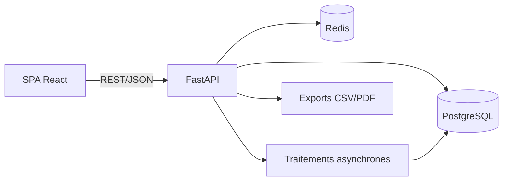
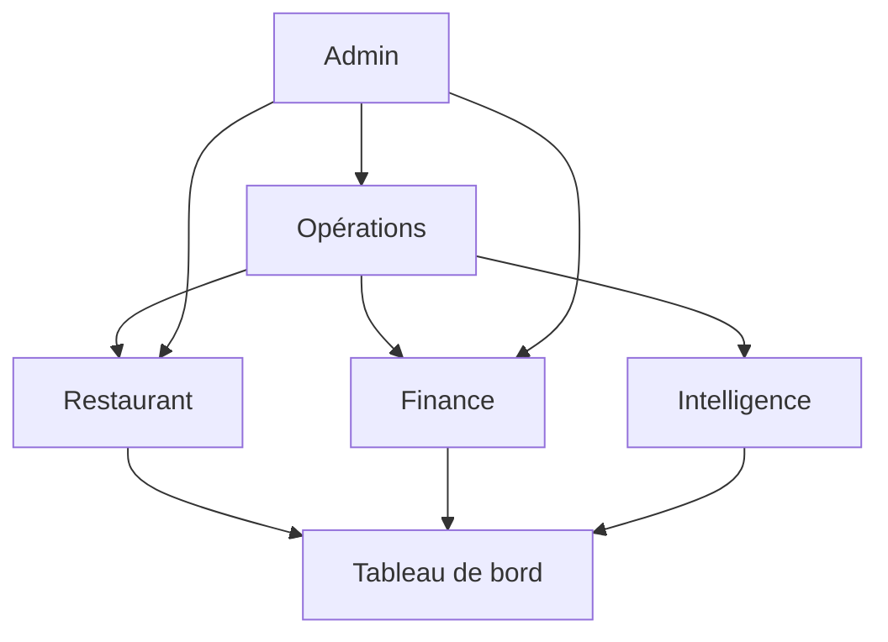
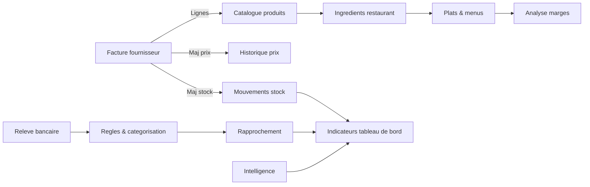
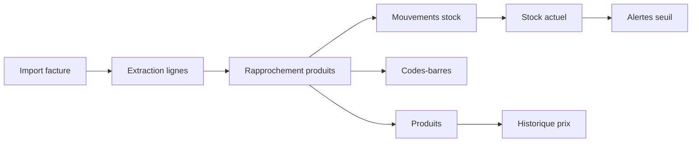
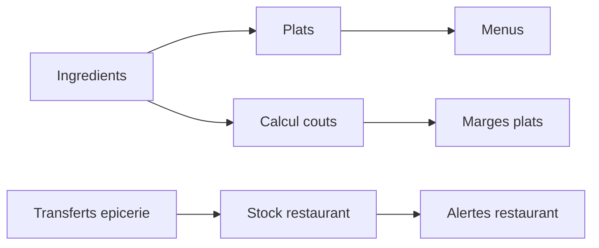
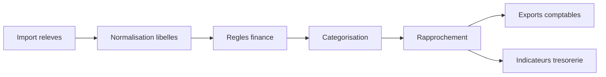
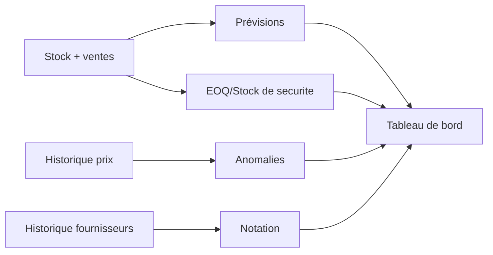

# Conception (conception et architecture)

## 1. Vision produit
Plateforme unifiee pour piloter les activites Epicerie, Restaurant et Tresorerie.
Objectif : fiabiliser les donnees, industrialiser les flux (factures, stock, tresorerie)
et fournir une vision marge/ROI exploitable au quotidien.

## 2. Perimetre fonctionnel (modules)
- Opérations : catalogue, stock, factures, prix, approvisionnement.
- Restaurant : ingredients, plats, couts, menus, transferts.
- Finance : releves, categorisation, rapprochement, audit.
- Intelligence : previsions, optimisation stock, anomalies, marges.
- Tableau de bord : indicateurs consolides et alertes.
- Admin : configuration, securite, roles.

## 3. Principes de conception
- Multi-tenant natif (isolation des donnees par tenant).
- API-first : contrats stables pour SPA et integrations.
- Traçabilite : historisation des prix, mouvements et rapprochements.
- Observabilite : journaux structures, metriques, alertes.
- Robustesse : idempotence pour les operations sensibles.
- Evolutivite : modules independants et versionnables.

## 4. Architecture logique
Composants principaux :
- SPA React (Vite + Tailwind) pour les vues metier.
- API FastAPI pour la logique et l’orchestration.
- PostgreSQL multi-tenant (schema principal + tables analytiques).
- Traitements asynchrones (imports, recalculs, notation).
- Cache (Redis) optionnel pour acceleration.



## 4.1 Arbre fonctionnel (ASCII)
```
Plateforme
|-- Opérations
|   |-- Catalogue
|   |-- Stock & inventaires
|   |-- Factures fournisseurs
|   |-- Prix & approvisionnement
|-- Restaurant
|   |-- Ingredients
|   |-- Plats & menus
|   |-- Stock restaurant
|-- Finance
|   |-- Releves & categorisation
|   |-- Rapprochement
|   |-- Regles
|-- Intelligence
|   |-- Previsions
|   |-- Optimisation stock
|   |-- Anomalies
|   |-- Notation fournisseurs
|   |-- Marges
|-- Tableau de bord
|   |-- Indicateurs
|   |-- Alertes
`-- Admin
    |-- Tenants
    |-- Roles & droits
    `-- Audit
```

## 4.2 Carte des modules (graphe)


## 5. Flux metiers majeurs
- Factures fournisseurs : import -> extraction -> rapprochement -> validation -> mise a jour stock/prix.
- Stock : mouvements -> mise a jour stock_actuel -> alertes seuils.
- Restaurant : ingredients -> plats -> calcul couts -> menus.
- Tresorerie : import -> categorisation -> rapprochement -> export comptable.
- Intelligence : calculs (EOQ, ABC/XYZ, marges, previsions) -> synthese tableau de bord.

## 5.1 Graphe des flux de donnees (tracabilite)


## 5.2 Arbre des flux critiques (ASCII)
```
Flux critiques
|-- Facture -> Stock -> Alertes
|-- Facture -> Prix -> Marges
|-- Releve -> Categorisation -> Rapprochement -> Exports
|-- Ingredients -> Plats -> Prix vente
`-- Ventes -> Previsions -> Approvisionnement
```

## 5.3 Tracabilite par module
### 5.3.1 Opérations


### 5.3.2 Restaurant


### 5.3.3 Finance


### 5.3.4 Intelligence


## 6. Securite et gouvernance
- Authentification OAuth2/JWT.
- RBAC par module et par action.
- Journal d’audit des operations sensibles.
- Isolation des donnees par tenant.

## 7. Exigences non fonctionnelles
- Disponibilite : 99.5% cible.
- Performance : P90 < 300ms pour les endpoints critiques.
- Resilience : reprise d’imports et rejouabilite.
- Traçabilite : historique et audit complet.

## 8. Risques et mitigations
- Qualite des donnees (doublons, libelles incoherents) : workflow data-quality.
- Imports heterogenes : mapping, regles, rapport d’erreurs.
- Charge analytique : cache + tables de synthese.

## 9. Livrables associes
- SFG, SFD.
- UML (cas d’usage, sequence, activites).
- Wireframes fonctionnels.
- DAT, ST, schemas d’architecture, MCD/MLD.
