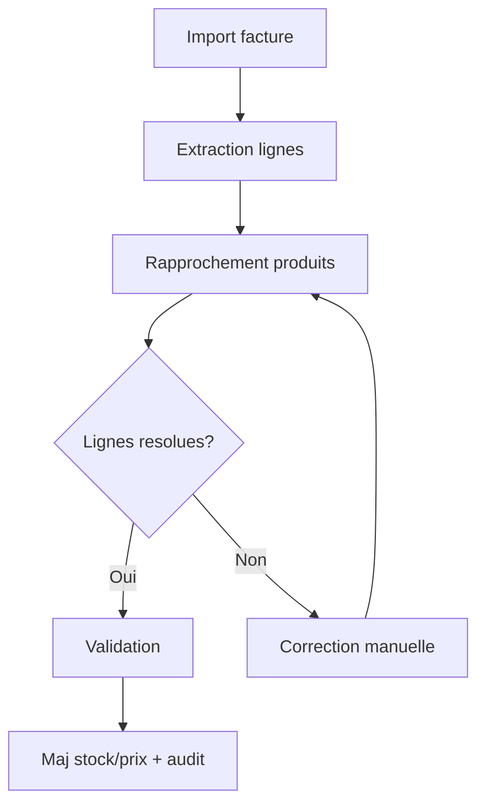

# Specifications fonctionnelles detaillees (SFD)

## 1. Catalogue produits
### 1.1 Creation produit
Champs obligatoires : nom, unite, type (stockable/non-stockable).
Optionnels : categorie, codes-barres, TVA, seuil_alerte.
Regles :
- Un code-barres est unique par tenant.
- Un produit supprime est archive (pas de suppression physique).

### 1.2 Historique des prix
- Chaque modification de prix d’achat cree une entree d’historique.
- Le prix actif = derniere entree validee.

### 1.3 Qualite catalogue
- Detection doublons (nom proche, code-barres similaire).
- Ecran de fusion avec conservation de l’historique.

## 2. Stock et inventaires
### 2.1 Mouvements
Types : ENTREE, SORTIE, TRANSFERT, INVENTAIRE.
Chaque mouvement enregistre date, utilisateur, source et quantite.

### 2.2 Inventaire
- Session par zone.
- Saisie quantites constatees.
- Calcul ecarts.
- Validation -> ajustement stock_actuel.

### 2.3 Alertes
- Seuil minimum par produit.
- Liste priorisee des ruptures et quasi-ruptures.

## 3. Factures fournisseurs
### 3.1 Import
Formats : PDF, CSV.
Extraction : libelle, quantite, prix unitaire, total.

### 3.2 Rapprochement
Priorites : code-barres, ref fournisseur (SKU), similarite libelle.
Lignes non resolues : correction manuelle obligatoire.

### 3.3 Validation
- Creation/maj produit si accepte.
- Maj prix d’achat + stock si facture livree.
- Journal d’audit associe.

## 4. Restaurant
### 4.1 Ingredients
- Creer/consulter/modifier/supprimer ingredients.
- Liaison optionnelle a un produit epicerie.
- Historique des prix ingredient.

### 4.2 Plats et menus
- Plat = liste d’ingredients + quantites.
- Calcul cout matiere par plat.
- Menus = aggregation de plats.
- Simulation de prix de vente.

### 4.3 Stock restaurant
- Mouvements dedies + transferts depuis epicerie.
- Tableau de bord stock restaurant.

## 5. Finance
### 5.1 Import releves
Formats CSV/OFX.
Normalisation des libelles.

### 5.2 Categorisation
Regles automatiques (mots-cles, IBAN, montant).
Transactions non categorisees en attente.

### 5.3 Rapprochement
- Rapprochement automatique transactions/factures.
- Creation d’alias fournisseurs.
- Rapprochement manuel si necessaire.

## 6. Intelligence
### 6.1 Previsions
- Ventes (periode, categorie, produit).
- Tresorerie (entre/sorties).

### 6.2 Optimisation stock
- EOQ (quantite economique de commande).
- Stock de securite.
- Points de reapprovisionnement et suggestions.
- Classification ABC/XYZ.

### 6.3 Anomalies
- Detection d’anomalies prix/stock.
- Rapport et suivi des resolutions.

### 6.4 Notation fournisseurs
- Score global et par dimension.
- Historique et alertes.

### 6.5 Marges
- Instantanes et evolution.
- Analyse par categorie et produit.

## 7. Gouvernance et securite
- RBAC par module.
- Journal d’audit (actions, modifications, rapprochements).
- Sauvegardes planifiees.

## 8. Cas limites
- Facture annulee : creation d’une operation inverse.
- Transaction bancaire ancienne : rapprochement manuel.
- Multi-tenant : aucune fuite inter-tenant.

## 9. Parcours end-to-end (ASCII)
```
1) Catalogue
   -> Creation produit -> Code-barres -> Prix
2) Facture
   -> Import -> Rapprochement -> Validation -> Stock + Prix
3) Restaurant
   -> Ingredients -> Plats -> Menus -> Prix vente
4) Finance
   -> Releve -> Regles -> Rapprochement -> Export
5) Intelligence
   -> Previsions -> Suggestions -> Actions
```

## 10. Flux de validation facture (graphe)


## 11. Arbres par processus (ASCII)
```
Processus Facture fournisseur
|-- Import
|   |-- Televersement PDF/CSV
|   `-- Controle format
|-- Extraction
|   |-- Parsing lignes
|   `-- Normalisation libelles
|-- Rapprochement
|   |-- Code-barres
|   |-- Ref fournisseur (SKU)
|   `-- Similarite libelle
|-- Validation
|   |-- Correction manuelle
|   `-- Confirmation
`-- Impact
    |-- Maj prix
    |-- Maj stock
    `-- Audit
```

```
Processus Inventaire
|-- Preparation
|   |-- Zone
|   `-- Responsable
|-- Saisie
|   |-- Scan produit
|   `-- Quantite constatee
|-- Ecart
|   |-- Calcul automatique
|   `-- Justification
`-- Validation
    |-- Ajustements stock
    `-- Cloture session
```

```
Processus Rapprochement bancaire
|-- Import releve
|   |-- CSV/OFX
|   `-- Normalisation
|-- Categorisation
|   |-- Regles auto
|   `-- Manuelle
|-- Rapprochement
|   |-- Factures
|   `-- Operations internes
`-- Validation
    |-- Statut rapproche
    `-- Export comptable
```

```
Processus Synchronisation prix restaurant
|-- Preparation
|   |-- Liens epicerie
|   `-- Ingredients eligibles
|-- Synchronisation
|   |-- Recuperation prix
|   `-- Mise a jour ingredient
`-- Suivi
    |-- Historique prix
    `-- Rapport synchro
```

```
Processus Previsions et approvisionnement
|-- Collecte
|   |-- Ventes historiques
|   `-- Stock courant
|-- Calcul
|   |-- Previsions
|   `-- Stock de securite
|-- Suggestion
|   |-- Points de reapprovisionnement
|   `-- Plan d’appro
`-- Execution
    |-- Creation commande
    `-- Suivi livraison
```
