# Diagrammes UML

## 1. Cas d’usage (vue d’ensemble)
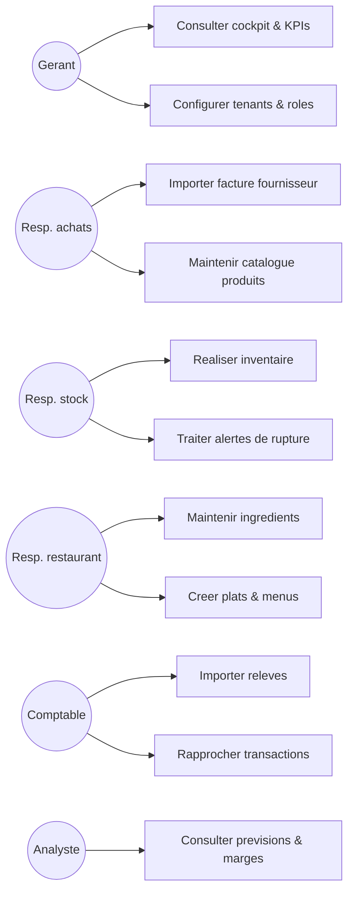

## 1.1 Diagramme de composants (haut niveau)
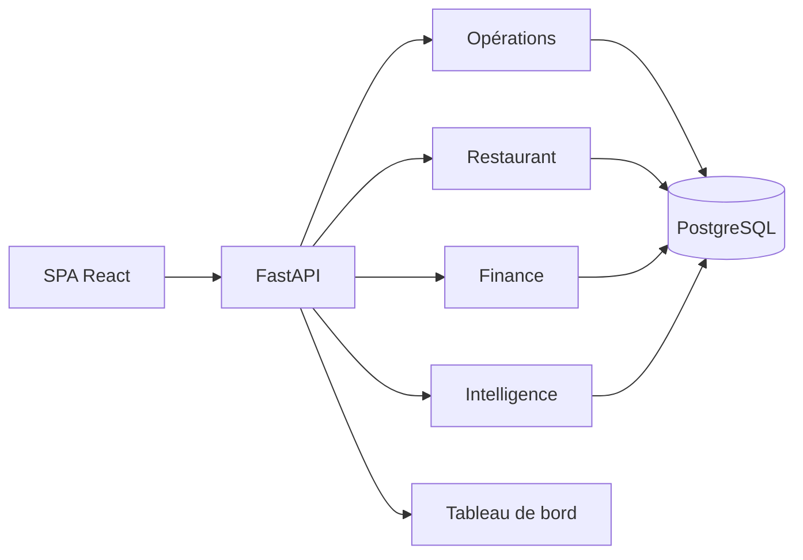

## 2. Sequence : Import facture fournisseur
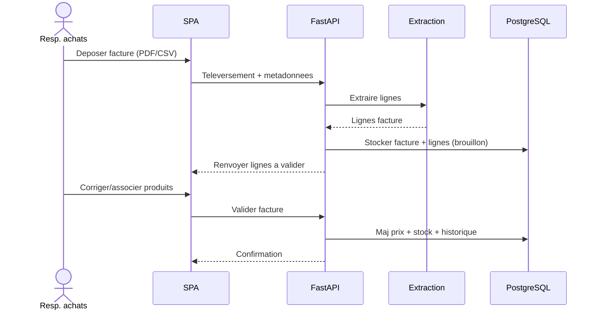

## 3. Sequence : Rapprochement bancaire
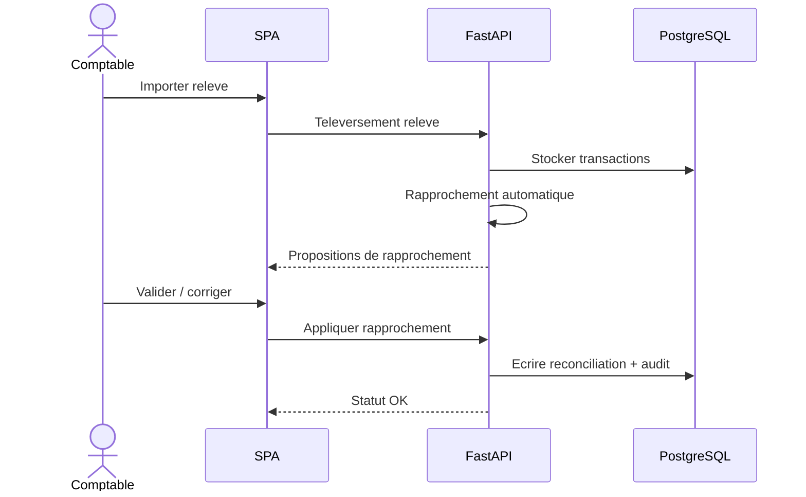

## 4. Sequence : Optimisation stock (EOQ / reapprovisionnement)
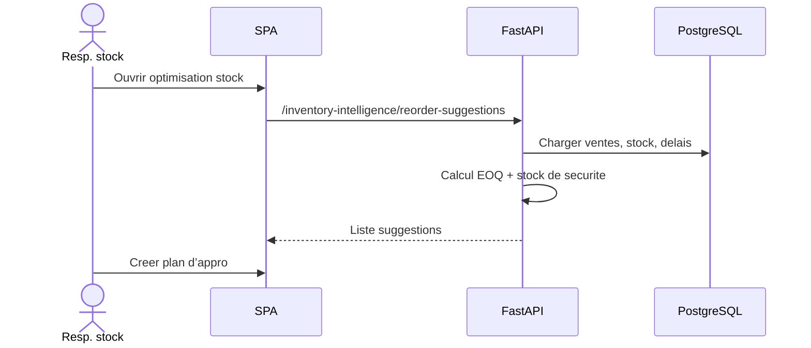

## 5. Sequence : Synchronisation prix restaurant
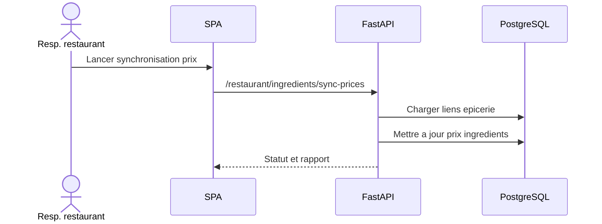

## 6. Activite : Inventaire
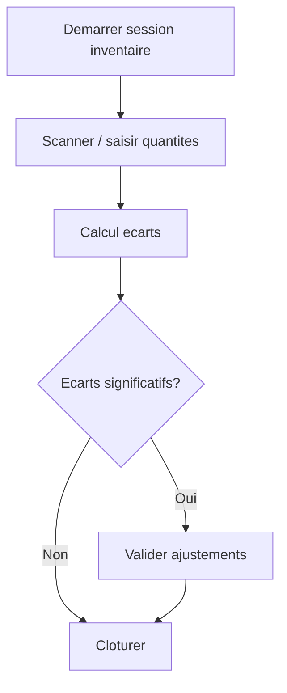

## 7. Activite : Categorisation bancaire
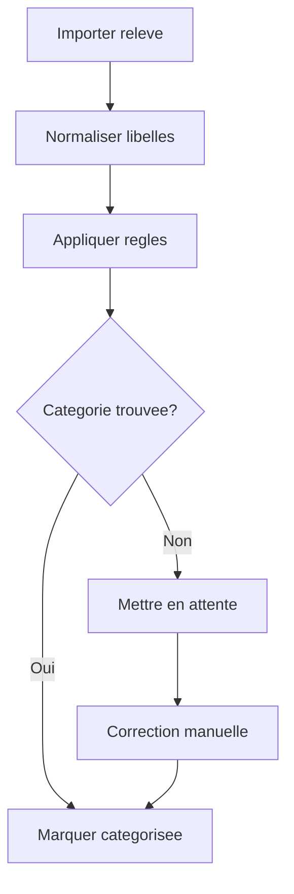

## 8. Etat : Facture fournisseur
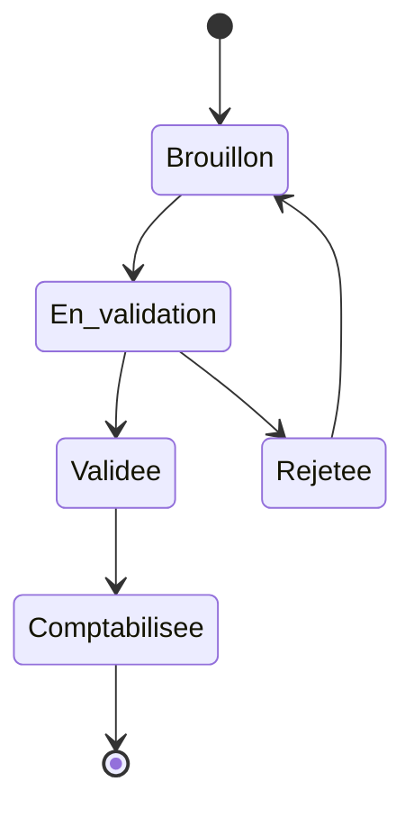

## 9. Sequence : Ajustement stock (inventaire)
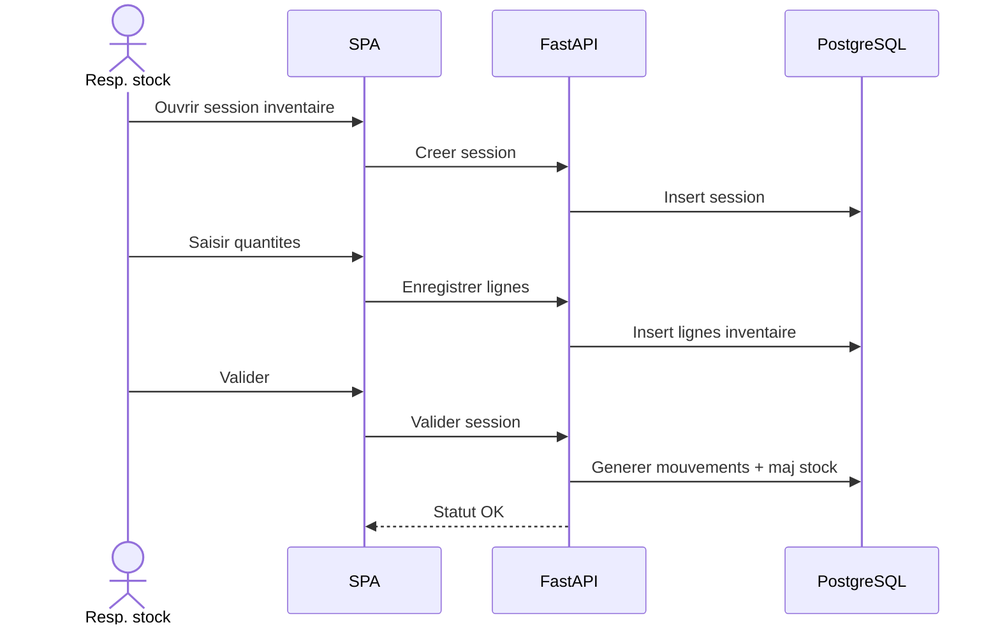

## 10. Sequence : Application regles finance
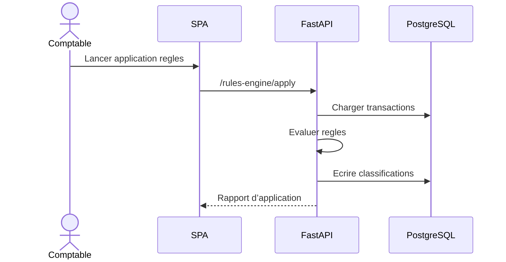

## 11. Diagramme de classes (domaines cles)
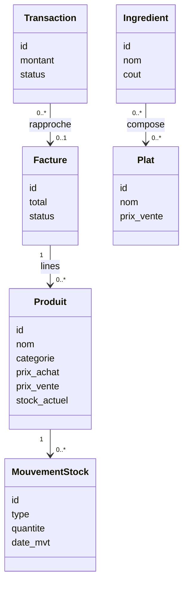

## 12. Sequence : Calcul marges (snapshots)
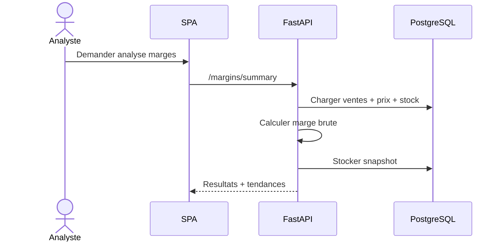

## 13. Sequence : Detection anomalies
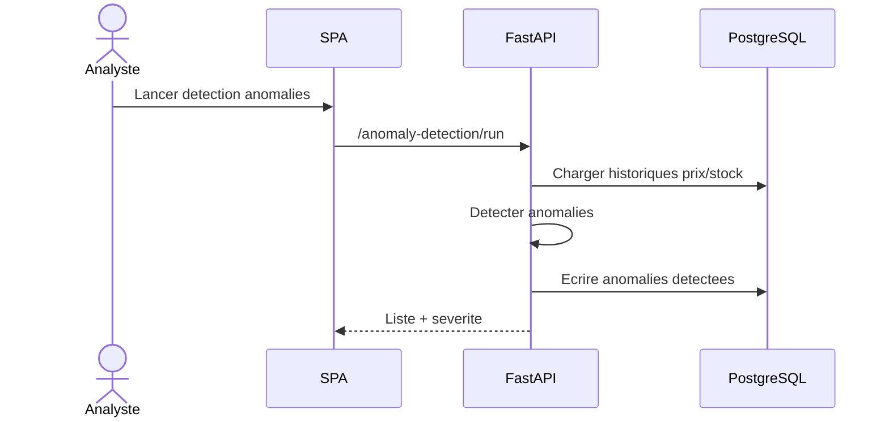

## 14. Sequence : Notation fournisseurs
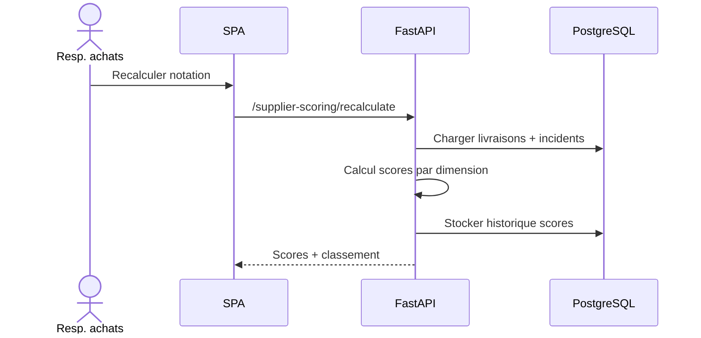
