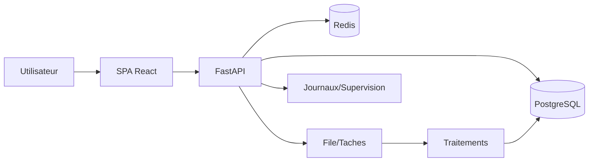
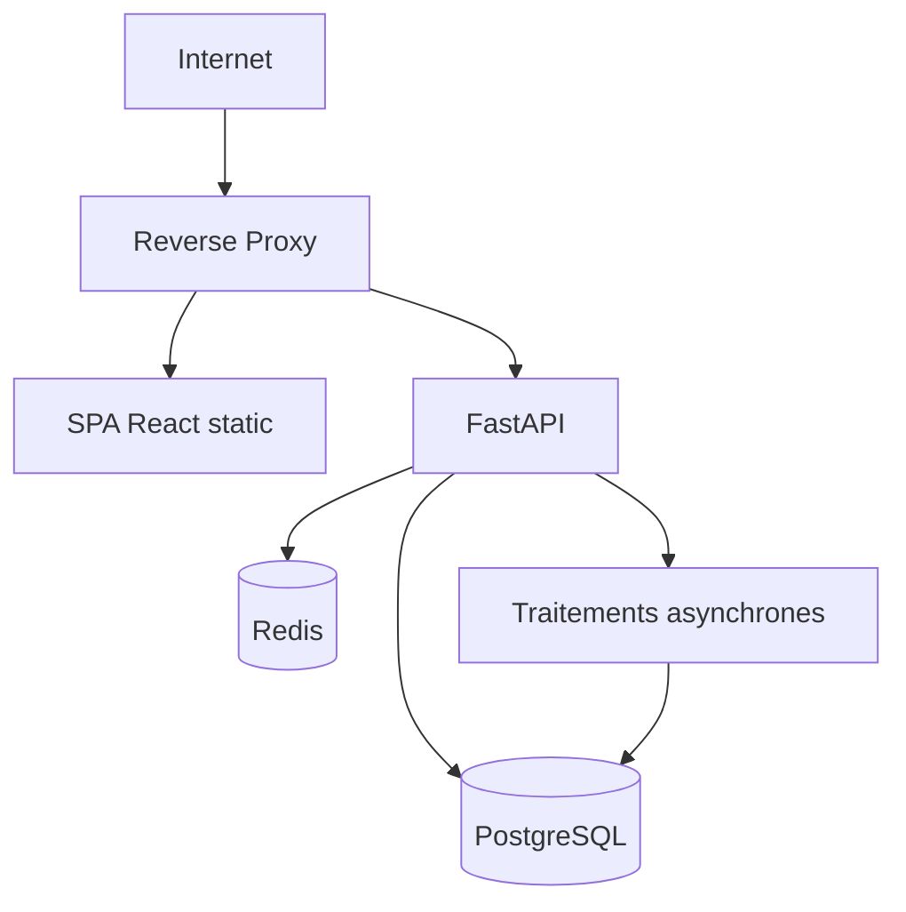

# Dossier d’architecture technique (DAT)

## 1. Contexte
Plateforme web multi-tenant pour Epicerie/Restaurant/Tresorerie avec modules
Intelligence et tableau de bord. Pile : SPA React, API FastAPI, PostgreSQL, traitements asynchrones.

## 2. Objectifs techniques
- Scalabilite horizontale de l’API.
- Isolation logique par tenant.
- Observabilite des imports et des erreurs.
- Deploiement reproductible via Docker.

## 3. Architecture logique
Composants :
- Frontend SPA (Vite + React + Tailwind).
- Backend API (FastAPI) + intergiciels (idempotence, performance, contexte de requete).
- Base PostgreSQL (schema principal + tables analytiques).
- Traitements asynchrones (imports, notation, previsions).
- Cache Redis optionnel.



## 3.1 Arbre d’infrastructure (ASCII)
```
Infra
|-- Reverse Proxy / LB
|   |-- TLS termination
|   `-- Routage UI/API
|-- Frontend
|   `-- SPA React (static)
|-- Backend
|   |-- FastAPI (REST)
|   |-- Traitements asynchrones
|   `-- Intergiciels (idempotence, performance, contexte)
|-- Donnees
|   |-- PostgreSQL
|   `-- Redis (cache)
`-- Observabilite
    |-- Journaux
    `-- Metriques
```

## 4.1 Graphe de deploiement (vue runtime)


## 4. Deploiement
- Services conteneurises avec docker-compose.
- Environnements : dev, staging, prod.
- Variables sensibles en .env.

## 5. Donnees et stockage
- Tables principales : produits, mouvements_stock, factures, restaurant_*, finance_*.
- Historisation : prix, marges, audit.
- Exports CSV/PDF sur volume partage.

## 6. Securite
- OAuth2/JWT.
- RBAC par module.
- TLS termine au reverse proxy.
- Journalisation des actions sensibles.

## 7. Observabilite
- Journaux structures par requete.
- Correlation ID (X-Request-Id).
- Metriques performance et cache.

## 8. Resilience
- Idempotency-Key pour requetes sensibles.
- Retry/reprise d’imports.
- Sauvegardes planifiees et restauration documentee.

## 8.1 Chaine d’import (graphe)


## 8.2 Arbre des dependances techniques (ASCII)
```
Systeme
|-- API FastAPI
|   |-- Middleware idempotence
|   |-- Middleware perf
|   `-- Middleware context
|-- Services metier
|   |-- Catalog
|   |-- Stock
|   |-- Finance
|   `-- Restaurant
`-- Donnees
    |-- PostgreSQL
    `-- Redis (optionnel)
```

## 8.3 Arbres par processus techniques (ASCII)
```
Processus Import facture (technique)
|-- Televersement
|   |-- Endpoint API /invoices/import
|   `-- Stockage fichier temporaire
|-- Extraction
|   |-- Traitement d'extraction
|   `-- Parsing lignes
|-- Rapprochement
|   |-- Service catalogue
|   `-- Regles de similarite
|-- Validation
|   |-- Transaction DB
|   `-- Idempotency-Key
`-- Audit
    |-- event_log
    `-- audit_trail
```

```
Processus Inventaire (technique)
|-- Session
|   |-- API /stock/inventory/session
|   `-- Table inventory_session
|-- Lignes
|   |-- API /stock/inventory/lines
|   `-- Table inventory_line
|-- Validation
|   |-- Transaction DB
|   |-- Insert mouvements_stock
|   `-- Maj stock_actuel (trigger)
`-- Journaux
    |-- Enveloppe reponse
    `-- Contexte requete
```

```
Processus Rapprochement bancaire (technique)
|-- Import releve
|   |-- API /finance/import
|   `-- Normalisation libelles
|-- Regles
|   |-- API /rules-engine/apply
|   `-- Table financial_rules
|-- Rapprochement
|   |-- Service bank_reconciliation
|   `-- Table bank_reconciliations
`-- Export
    |-- Generation CSV
    `-- Stockage fichier
```

```
Processus Previsions (technique)
|-- Collecte
|   |-- Requete ventes/stock
|   `-- Pre-aggregation
|-- Calcul
|   |-- Service forecasting
|   `-- Cache forecast_cache
|-- Exposition
|   |-- API /forecasting/*
|   `-- Tableau de bord
`-- Supervision
    |-- Metriques performance
    `-- Journaux
```

```
Processus Cache (technique)
|-- Lecture
|   |-- CacheManager.get
|   `-- TTL par module
|-- Invalidation
|   |-- API /cache/invalidate/{pattern}
|   `-- Tenant scope
`-- Fallback
    |-- Requete DB directe
    `-- Journal defaut de cache
```

## 9. Evolutivite
- APIs versionnees et tags par module.
- Tables analytiques separables.
- Extensions possibles (nouveaux modules).
