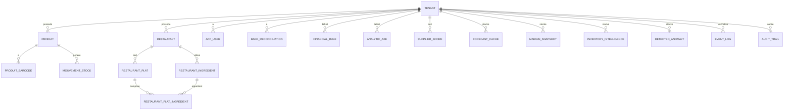
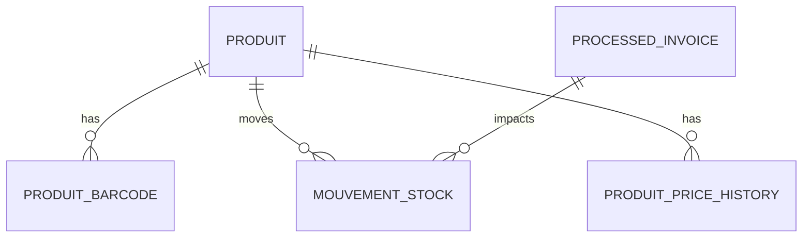
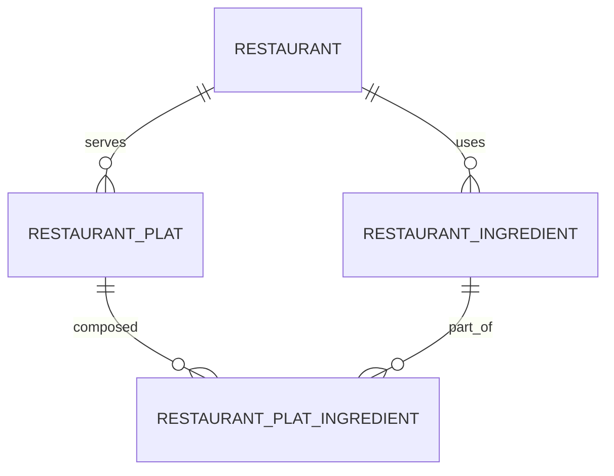
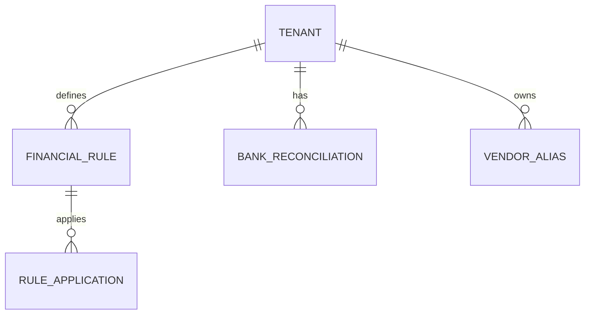

# Modele de donnees (MCD / MLD)

## 1. MCD (conceptuel)
Entites principales (alignement schema SQL):
- Tenant, Restaurant, Utilisateur applicatif
- Produit, Code-barres, MouvementStock, HistoriquePrix
- FactureFournisseur, FactureLigne, JobImportFacture
- IngredientRestaurant, PlatRestaurant, IngredientPlat, StockRestaurant
- TransactionBancaire, RegleFinance, Rapprochement, AliasFournisseur
- Intelligence : CachePrevisions, SnapshotMarge, IntelligenceStock, AnomalieDetectee
- Audit : JournalEvenements, PisteAudit



## 2. MLD (relationnel) - tables principales
- tenants(id PK, name, code, created_at)
- restaurants(id PK, tenant_id FK, nom, code, created_at)
- app_users(id PK, username, email, password_hash, role)

- produits(id PK, tenant_id FK, nom, categorie, prix_achat, prix_vente, tva, seuil_alerte, stock_actuel, actif)
- produits_barcodes(id PK, produit_id FK, tenant_id FK, code, symbologie, is_principal)
- mouvements_stock(id PK, produit_id FK, tenant_id FK, type, quantite, source, date_mvt)
- produits_price_history(id PK, produit_id FK, prix, effective_at)

- processed_invoices(id PK, tenant_id FK, supplier_name, total, status, created_at)
- audit_actions(id PK, tenant_id FK, action_type, status, created_at)
- audit_resolution_log(id PK, tenant_id FK, action_id FK, note, created_at)

- capital_snapshot(id PK, tenant_id FK, snapshot_date, amount)

- restaurant_depense_categories(id PK, tenant_id FK, label)
- restaurant_cost_centers(id PK, tenant_id FK, label)
- restaurant_fournisseurs(id PK, tenant_id FK, nom)
- restaurant_depenses(id PK, tenant_id FK, category_id FK, cost_center_id FK, montant)
- restaurant_ingredients(id PK, tenant_id FK, nom, unite, cout)
- restaurant_plats(id PK, tenant_id FK, nom, prix_vente)
- restaurant_plat_ingredients(id PK, plat_id FK, ingredient_id FK, quantite)
- restaurant_ingredient_price_history(id PK, ingredient_id FK, prix, date)
- restaurant_plat_price_history(id PK, plat_id FK, prix, date)
- restaurant_plat_costs(id PK, plat_id FK, cout, date)
- restaurant_alerts(id PK, tenant_id FK, type, message)
- restaurant_epicerie_sku_map(id PK, ingredient_id FK, produit_id FK)
- restaurant_stock_movements(id PK, tenant_id FK, type, quantite, date)

- bank_reconciliations(id PK, tenant_id FK, transaction_id, invoice_id, status)
- vendor_aliases(id PK, tenant_id FK, supplier_name, alias)
- financial_rules(id PK, tenant_id FK, name, rule_json, active)
- rule_applications(id PK, rule_id FK, applied_at)
- analytic_axes(id PK, tenant_id FK, name)
- analytic_assignments(id PK, tenant_id FK, axis_id FK, target_id, weight)

- supplier_scores(id PK, tenant_id FK, supplier_name, score)
- supplier_score_history(id PK, supplier_id FK, score, created_at)

- forecast_cache(id PK, tenant_id FK, scope, payload, created_at)
- margin_snapshots(id PK, tenant_id FK, scope, payload, created_at)
- inventory_intelligence(id PK, tenant_id FK, scope, payload, created_at)
- detected_anomalies(id PK, tenant_id FK, scope, payload, created_at)

- event_log(id PK, tenant_id FK, event_type, payload, created_at)
- audit_trail(id PK, tenant_id FK, actor, action, payload, created_at)

## 3. Contraintes principales
- Unicite (tenant_id, code) sur produits_barcodes.
- FK sur tenant_id pour toutes les tables metier.
- Suppression logique (actif=false) pour produits.

## 4. ER par module (graphe)
### 4.1 Opérations


### 4.2 Restaurant


### 4.3 Finance


## 5. Arbre des donnees (ASCII)
```
Donnees
|-- Opérations
|   |-- Produits / Codes-barres
|   |-- Mouvements stock
|   `-- Factures (processed_invoices)
|-- Restaurant
|   |-- Ingredients
|   |-- Plats
|   `-- Stock mouvements
|-- Finance
|   |-- Regles
|   |-- Rapprochements
|   `-- Aliases fournisseurs
`-- Intelligence
    |-- Cache previsions (forecast_cache)
    |-- Snapshots marges (margin_snapshots)
    `-- Anomalies detectees
```
