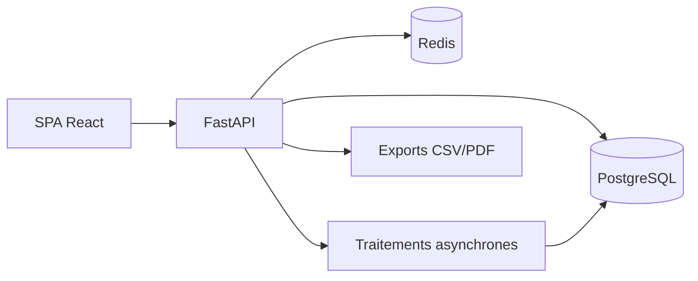
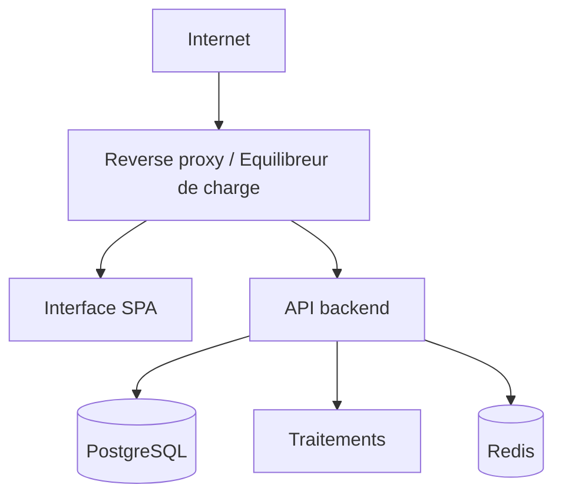
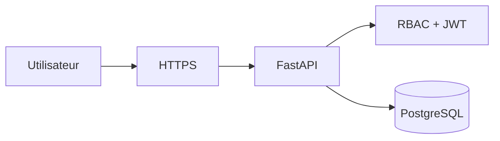
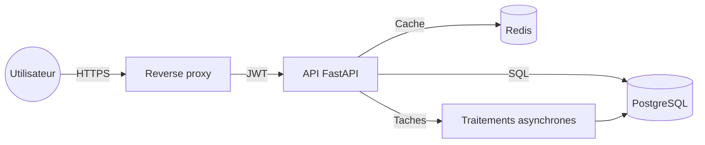

# Schemas d’architecture (applicative, reseau, securite)

## 1. Architecture applicative


## 2. Architecture reseau (vue simplifiee)


## 2.1 Arbre reseau (ASCII)
```
Internet
`-- Reverse proxy / LB
    |-- Interface SPA
    `-- API FastAPI
        |-- PostgreSQL
        `-- Redis
```

## 3. Architecture securite
- TLS termine au reverse proxy.
- OAuth2/JWT sur l’API.
- RBAC par module.
- Isolation logique par tenant.
- Journal d’audit.



## 3.1 Zones de securite (ASCII)
```
[Zone publique]
  |
  v
[Reverse proxy / TLS]
  |
  v
[Zone applicative]
  |-- API FastAPI
  `-- Traitements
  |
  v
[Zone donnees]
  |-- PostgreSQL
  `-- Redis
```

## 4. Diagramme de flux securise (DFD)

